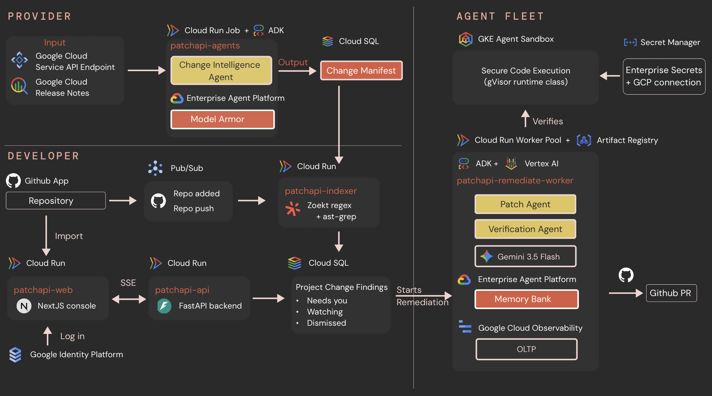

# PatchAPI

**Dependabot for APIs.** When an external API changes, PatchAPI finds the
affected code, generates and verifies a migration in an isolated environment,
and opens an evidence-backed pull request for normal human review.

Built for the [All Things Agentic Hackathon](https://allthingsagentichackathon.devpost.com/)
— Fortified Enterprise Fleet track.

Demo: [`amelia751/storygen`](https://github.com/amelia751/storygen).

## Architecture Diagram



Three lanes share one Postgres store and stop at a pull request.

**Provider.** Google Cloud service endpoints and release notes feed a Cloud Run
+ ADK job (`patchapi-agents`). The Change Intelligence Agent writes a Change
Manifest. Provider text is untrusted; Model Armor screens intake.

**Developer.** A GitHub App imports a repository into the Next.js console
(`patchapi-web`). Identity Platform handles sign-in. The console talks to the
FastAPI control plane (`patchapi-api`) over SSE. Import and push events go
through Pub/Sub to `patchapi-indexer`, which scans with Zoekt and ast-grep and
stores findings as Needs you, Watching, or Dismissed.

**Agent fleet.** Starting remediation hands the finding to
`patchapi-remediate-worker` (Cloud Run worker pool, ADK + Vertex, Gemini 3.5
Flash). A Patch Agent proposes a change; a separate Verification Agent grades
it. Generated code runs only in a GKE Agent Sandbox under gVisor. Secrets stay
in Secret Manager. A passing run opens a GitHub pull request.

## Live

| | URL |
|---|---|
| Console | https://patchapi-web-913371146929.us-central1.run.app |
| Control API | https://patchapi-api-913371146929.us-central1.run.app |
| Repo indexer | https://patchapi-indexer-913371146929.us-central1.run.app |
| GitHub webhook | https://patchapi-api-913371146929.us-central1.run.app/v1/github/webhooks |

GCP project `patch-505223`, region `us-central1`. Push to `main` deploys via
`.github/workflows/deploy-cloud-run.yml`.

Local: `http://localhost:3000` (console) and `http://localhost:8080` (API).

## Layout

```
.
├── README.md
├── pyproject.toml            uv workspace (Python 3.12)
├── uv.lock
├── Makefile
├── .env.example
├── cloudbuild.agents.yaml    agent-lane image
├── cloudbuild.ghtools.yaml   github-tools image
│
├── .github/workflows/
│   └── deploy-cloud-run.yml  push to main → Cloud Run
│
├── apps/web/                 patchapi-web · Next.js console
│   └── src/app/
│       ├── page.tsx          workspace  /
│       ├── provider/         provider portal
│       ├── changes/          findings inbox
│       ├── impact/
│       ├── runs/             [runId]
│       ├── fleet/
│       ├── settings/
│       └── auth/action/
│
├── services/
│   ├── control_api/          patchapi-api · FastAPI
│   │   └── routes/           health, providers, changes,
│   │                         runs, repositories, fleet,
│   │                         GitHub webhooks
│   ├── repo_indexer/         patchapi-indexer · Pub/Sub worker
│   │   ├── zoekt/            regex recall
│   │   └── astgrep/          call-site confirmation
│   ├── github_tools/         patchapi-github-tools
│   │   └── routes/           MCP + 10 capabilities
│   │                         (no merge / admin / secrets)
│   └── agent_runner/         patchapi-remediate-worker
│       └── remediation/      claim RECEIVED rows, slices,
│                             checkout, sandbox, PR
│
├── agents/                   Google ADK fleet
│   ├── orchestrator.py       deterministic state machine
│   ├── specialists/          change_intelligence, impact,
│   │                         patch, verification
│   ├── tools/                change, impact, patch, policy, pr
│   └── fixtures/             pinned change manifests
│
├── packages/                 shared Python libraries
│   ├── schemas/              ChangeManifest, ImpactReport,
│   │                         PolicyDecision, PatchPlan,
│   │                         VerificationReport
│   ├── providers/            Google ingest adapters
│   ├── policy/               injection gate + Model Armor
│   ├── state/                Cloud SQL / Postgres
│   ├── events/               Pub/Sub envelopes
│   ├── github/               capability enum (no tokens)
│   ├── repo_scan/            identifier inventory
│   ├── memory/               Vertex Memory Bank
│   ├── observability/        OTLP → Cloud Trace
│   ├── platform/             Agent Registry
│   └── auth/                 Identity Platform, OAuth
│
├── skills/
│   ├── google_imagen_migration/
│   └── google_gemini20_migration/
│
├── sandbox/
│   ├── runner/               isolated apply / build / test
│   └── gke/                  Agent Sandbox + gVisor
│
├── db/
│   ├── migrations/           0001–0024  (users → audit)
│   └── seeds/                console + Google provider
│
├── infra/terraform/
│   ├── environments/         dev, demo
│   └── modules/              Cloud Run, Cloud SQL, GKE,
│                             Pub/Sub, secrets, registry
│
├── demo/fixtures/            provider notice JSON
├── docs/architecture.png
├── scripts/                  bootstrap, smoke, verify
└── tests/                    integration + fixtures
```
