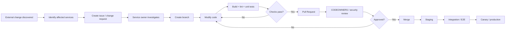
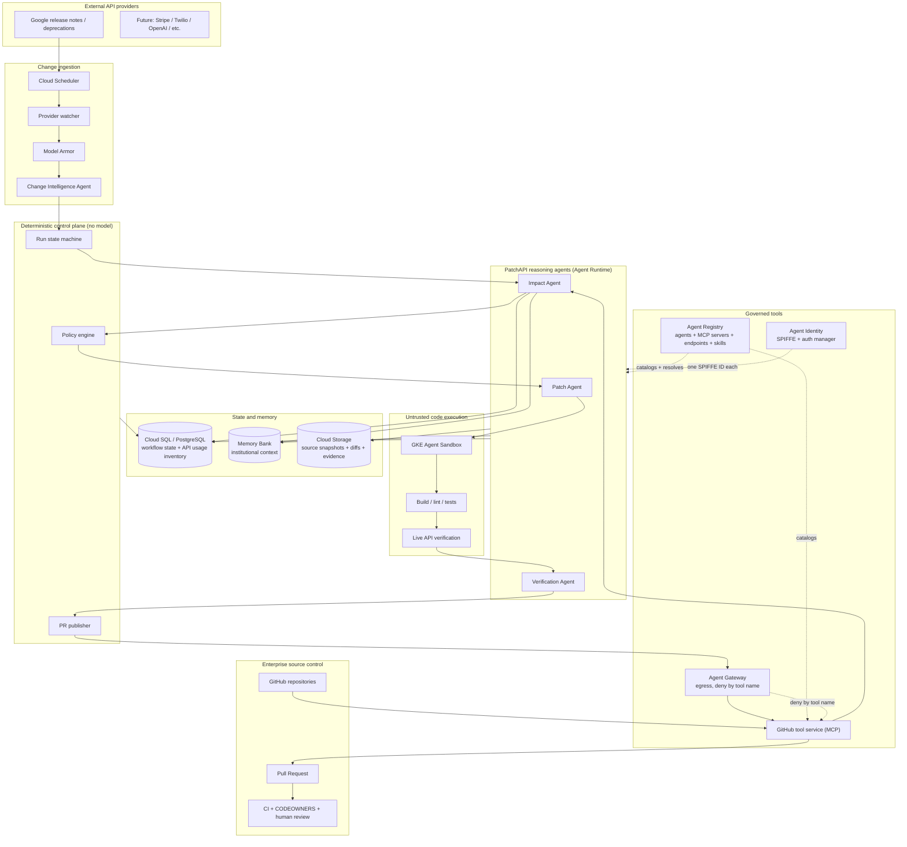
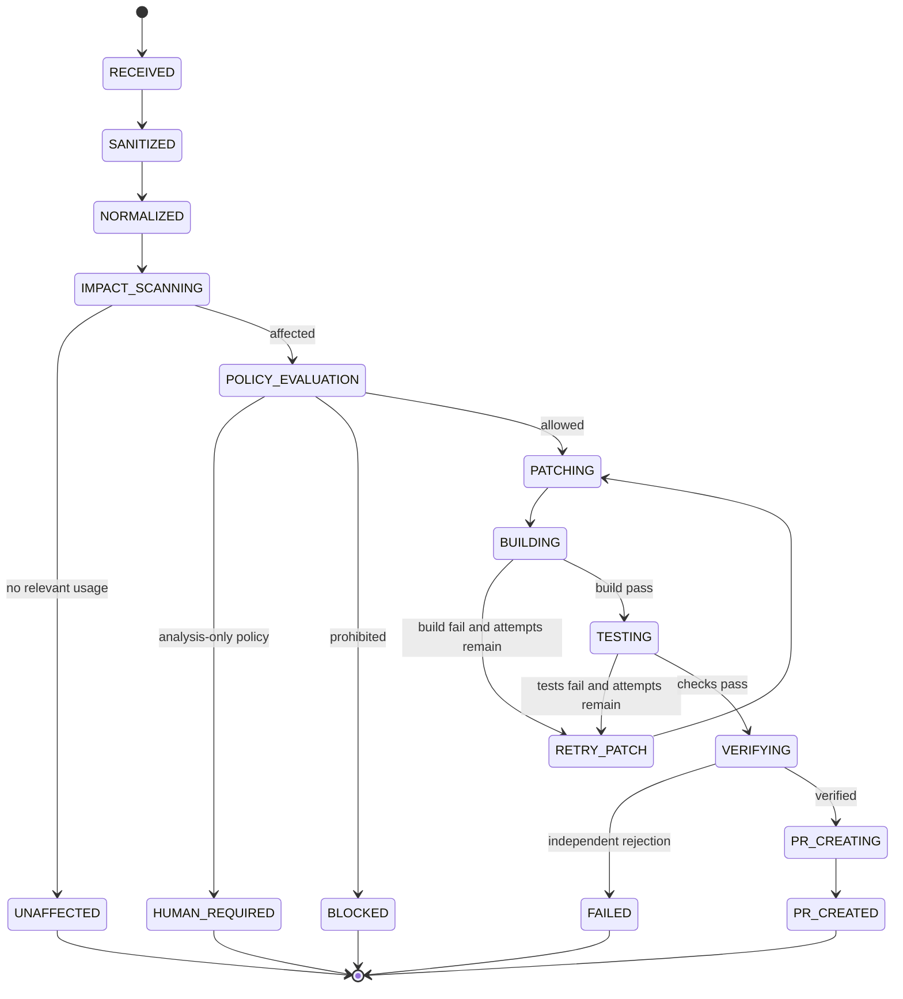
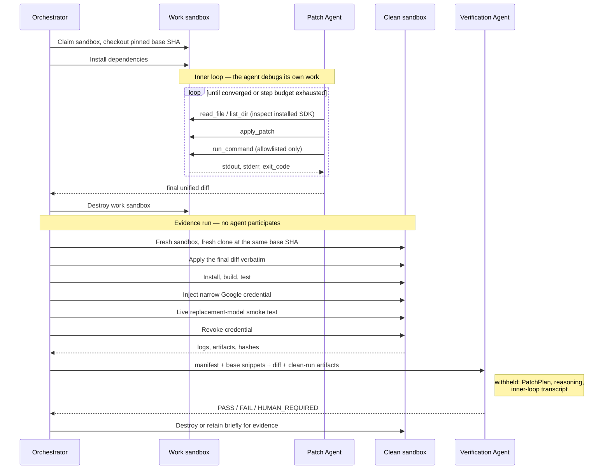
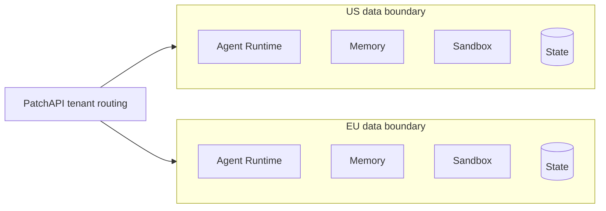
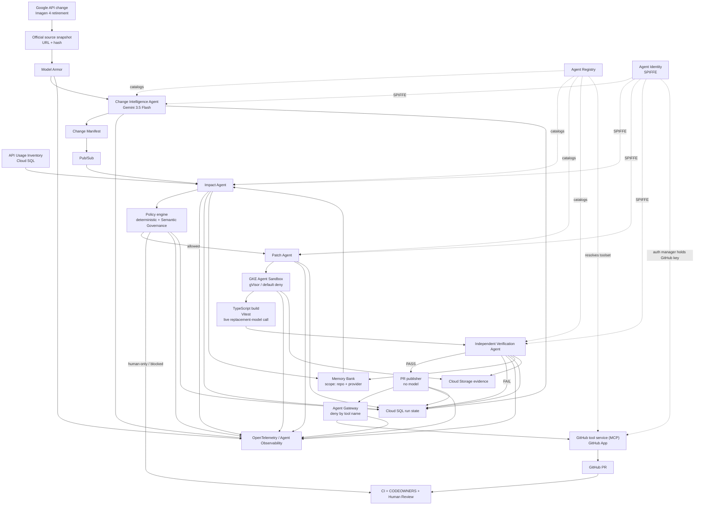

# PatchAPI — `roadmap.md`

> **PatchAPI: Dependabot for APIs.**  
> When an external API changes, PatchAPI finds the affected code, generates and verifies a migration in an isolated environment, and opens an evidence-backed pull request for normal human review.

**Hackathon:** All Things Agentic Hackathon — Fortified Enterprise Fleet  
**Roadmap version:** 2026-08-12  
**Submission deadline:** 2026-08-31 8:00 PM EDT  
**Primary demo target:** [`remorses/egaki`](https://github.com/remorses/egaki)  
**Primary live migration:** Google Imagen 4 → Gemini 3.x Image (three retired IDs onto two replacement models)  
**Reasoning model for PatchAPI agents:** Gemini 3.5 Flash or newer, with Gemini 3.5 Flash as the default hackathon configuration  
**Agent framework:** Google Agent Development Kit (ADK), Python

---

## 0. Executive summary

PatchAPI monitors API-provider releases and deprecations, converts them into structured change manifests, determines which enterprise repositories are affected, safely generates repository-specific fixes, verifies those fixes in isolated GKE Agent Sandboxes, and opens pull requests with test evidence.

The product intentionally **stops at the pull request**. PatchAPI does not bypass CODEOWNERS, branch protection, security review, CI, or deployment gates. Existing enterprise software-development controls remain authoritative.

The key design principle is:

> **External providers can describe changes; they do not receive direct access to customer source code.**

A vendor release note, changelog, OpenAPI change, migration guide, or provider-authored agent is treated as **untrusted external input**. PatchAPI's internal enterprise agents decide what the change means for the organization's code.

For the hackathon, the flagship scenario uses a real and unusually timely Google change:

- Google has deprecated:
  - `imagen-4.0-generate-001`
  - `imagen-4.0-ultra-generate-001`
  - `imagen-4.0-fast-generate-001`
- Google lists **August 17, 2026** as the hard shutdown date, with no announced grace period.
- The replacement is **not a single model**. Google's published mapping is:

| Retired identifier | Replacement | Required configuration |
|---|---|---|
| `imagen-4.0-fast-generate-001` | `gemini-3.1-flash-image` | thinking level `MINIMAL` |
| `imagen-4.0-generate-001` | `gemini-3.1-flash-image` | thinking level `HIGH` |
| `imagen-4.0-ultra-generate-001` | `gemini-3-pro-image` | different model family member |

- The call surface changes as well: `generate_images` becomes `generate_content`,
  responses become content parts rather than a dedicated image object,
  `negativePrompt` and `imageFormat` are gone, `numberOfImages` requires a loop,
  `aspectRatio` moves into a nested `ImageConfig`, and SynthID watermarking is
  unconditional.
- Egaki contains Imagen 4 usages across runtime, configuration, tests, and docs,
  and distinguishes Imagen capabilities from Gemini image-model capabilities.

This is a three-to-two model mapping with per-identifier configuration and a
changed request/response shape. A migration that rewrites model-ID strings is
wrong. That is the entire product thesis, and this change proves it.

Official Google source:
- https://ai.google.dev/gemini-api/docs/deprecations
- https://ai.google.dev/gemini-api/docs/changelog
- https://ai.google.dev/gemini-api/docs/imagen
- https://firebase.google.com/docs/ai-logic/imagen-models-migration

### Provider evidence is genuinely ambiguous here

Google's own pages disagree. The Imagen model page's migration prose says to use
`gemini-2.5-flash-image`, while the deprecation table and the Firebase migration
guide both say `gemini-3.1-flash-image`. Separately,
`gemini-3.1-flash-image-preview` — the identifier Egaki's model catalog points at
at the pinned SHA — was **retired on July 17, 2026** and no longer resolves.

Do not paper over this. It is a live, citable instance of exactly the condition
hard constraint #10 exists for. The Change Intelligence Agent must corroborate
across sources and escalate rather than pick a winner silently.

Egaki:
- https://github.com/remorses/egaki

---

# 1. Hackathon goal and track fit

PatchAPI should be entered in **Fortified Enterprise Fleet**, not Taskmaster.

The Fleet implementation must demonstrate the four categories required by the
track. Each row below names the **specific API surface** PatchAPI calls, not an
aspiration. Anything PatchAPI cannot demonstrably call is not a claim we make.

| Fleet requirement | Surface | Launch stage | PatchAPI integration | Load-bearing? |
|---|---|---|---|---|
| Discovery & Lifecycle | **Agent Registry** (`agentregistry.googleapis.com`) | GA 2026-06-18 | The four agents auto-register on Agent Runtime deploy. The GitHub tool service registers as an `McpServer`; the sandbox runner as an `Endpoint`. The Patch path resolves the GitHub toolset at runtime via `AgentRegistry.get_mcp_toolset()`. | **Yes** — remove it and tool resolution fails |
| Discovery & Lifecycle | **Skill Registry** (`GCPSkillRegistry` + `SkillToolset`) | Preview | The Google image-migration skill is published as a `Skill` with revisions; the Patch Agent retrieves it by semantic search rather than static injection. | Should-have |
| Core Execution | **Agent Runtime** (`reasoningEngines`) | GA | Each agent deploys as its own Runtime instance. Supports runs up to 7 days. | **Yes** |
| State | **Memory Bank** (`agent_engines.memories`) | GA | Repository-scoped institutional memory using a custom scope dict, not per-user. | **Yes** |
| State | **Cloud SQL / Postgres** | GA | Authoritative deterministic workflow state. Memory Bank is never the source of truth for run status. | **Yes** |
| Security | **Agent Identity** (`agentidentity.googleapis.com`) | Preview | One SPIFFE ID per agent. Auth manager brokers the GitHub App credential so no agent holds a raw token. | **Yes** |
| Security | **Agent Gateway** (`gcloud network-services agent-gateways`) | GA 2026-06-18 | Egress mode in front of the GitHub MCP server. Deny-by-tool-name enforces "never merge" at the network layer. | **Yes** — this is the security demo |
| Security | **Model Armor** (`modelarmor.googleapis.com`) | GA | `sanitizeUserPrompt` on every ingested provider document; gateway-inline inspection on tool calls; project floor settings as the org baseline. | **Yes** |
| Security | **Semantic Governance policies** | Preview 2026-06-29 | Natural-language constraints in dry-run, then one enforced rule. Defence in depth only. | Should-have |
| Telemetry | **Agent Observability** / Telemetry (OTLP) API | GA 2026-06-18 | ADK built-in OpenTelemetry exports to Cloud Trace; one trace ID per remediation run; Model Armor interceptions appear in the same traces natively. | **Yes** |

### The rule this table encodes

Every one of these is a *judging criterion*, not polish. A surface that only
appears in a screenshot scores nothing. Prefer integrations that break the build
when removed:

- resolve the GitHub toolset **through** Agent Registry rather than a hardcoded URL,
- route tool calls **through** Agent Gateway rather than direct HTTPS,
- read the Fleet dashboard page **from** the Registry API rather than a local table.

Competition brief:
- https://allthingsagentichackathon.devpost.com/

### Hackathon-wide requirements to satisfy explicitly

The submission should visibly prove:

1. Gemini 3.5 or newer is used.
2. Google ADK is used as the primary agent framework.
3. Google Cloud infrastructure is used in production.
4. The backend is actually deployed on Google Cloud.
5. The repository includes reproducible setup instructions.
6. The submission includes a clear architecture diagram.
7. The ~4-minute video demonstrates the project working, not merely slides.

### Judging optimization

The architecture is designed around the published weighting:

- **40% Innovation & Operational Utility**
- **30% Architectural Discipline & Tech Stack**
- **30% Demo & Production Readiness**

PatchAPI should therefore prioritize:
- a real change,
- real affected code,
- a real patch,
- real build/tests,
- a real sandbox,
- a real PR,
- visible policy enforcement,
- visible trace/audit evidence.

Do not spend the demo explaining hypothetical enterprise scale for three minutes.

---

# 2. Product scope

## 2.1 MVP promise

Given:

1. an official provider change, and
2. a GitHub organization/repository installation,

PatchAPI can:

1. ingest the provider change,
2. normalize it into a `ChangeManifest`,
3. identify affected repositories/usages,
4. classify migration risk,
5. generate a patch,
6. execute the patch in an isolated GKE Agent Sandbox,
7. run deterministic verification,
8. run an independent Verification Agent,
9. create a pull request with evidence,
10. retain organizational context for future changes,
11. expose a complete trace of what happened.

## 2.2 What PatchAPI does not do

For the hackathon version, PatchAPI does **not**:

- merge PRs,
- deploy production code,
- edit GitHub branch-protection rules,
- modify IAM,
- rotate secrets,
- directly execute vendor-supplied code,
- allow vendor agents to browse unrestricted customer repositories,
- promise automatic migration for every API,
- build a full enterprise code-search platform,
- support every source-control system.

These are deliberate boundaries, not missing features.

---

# 3. Enterprise code-change model

A normal enterprise flow is approximately:



PatchAPI automates the expensive, frequently neglected part:

```text
provider announces change
        ↓
who is affected?
        ↓
what must change?
        ↓
can we patch safely?
        ↓
does the patch really work?
        ↓
open a reviewable PR
```

PatchAPI then hands control back to normal enterprise CI and review.

---

# 4. Primary architecture



## 4.1 Why four reasoning agents, not six

Every agent is a failure mode, a prompt to maintain, an identity to govern, and a
place nondeterminism can enter. An agent earns its place only if it satisfies
both tests:

1. the work requires model judgement, and
2. it needs a separately governed identity and permission boundary.

| Component | Model judgement? | Distinct identity? | Verdict |
|---|---|---|---|
| Change Intelligence | Yes — extracts semantics from untrusted prose | Yes — must be denied all source access | **Agent** |
| Impact | Yes — runtime vs test vs docs vs dead code | Yes — read-only source, no write | **Agent** |
| Patch | Yes — the core reasoning task | Yes — sandbox workspace only | **Agent** |
| Verification | Yes — and hard constraint #6 forbids self-grading | Yes — read evidence, cannot modify | **Agent** |
| Policy & risk | **No** | n/a | Deterministic engine + Semantic Governance |
| PR creation | **No** | n/a | Deterministic publisher step |

### Why policy is not an agent

Section 8.3 requires that hard controls never depend solely on an LLM, and then
lists six deterministic enforcement layers. Putting a model in front of those
layers adds nondeterminism to the one component that must be predictable, and
duplicates a capability the platform already ships: Semantic Governance policies
evaluate proposed tool calls against natural-language business rules at runtime,
at the gateway, with a dry-run mode.

So: a deterministic Python policy engine produces the verdict, and Semantic
Governance runs alongside as a second, probabilistic opinion. Neither can
silently override the other — a disagreement escalates to `HUMAN_REQUIRED`.

### Why PR creation is not an agent

The PR step renders a template and makes three idempotent API calls. There is no
judgement in it. Placing a model at that step puts nondeterminism at the single
most dangerous point in the system — the only place holding GitHub write
capability — where its only available contributions are hallucinating a PR body
or mishandling a retry.

Removing it buys a much stronger guarantee, which the demo should state plainly:

> No model in PatchAPI has write access to GitHub.

### This does not make the fleet look thin

Agent Registry catalogs `Agent`, `McpServer`, `Endpoint`, `Skill`,
`SkillRevision`, and `Publisher` resources. The registered inventory is still
four agents, one MCP server, one sandbox endpoint, and a versioned migration
skill.

Cross-department reuse is better demonstrated by one generic Patch Agent plus a
swappable provider skill than by six bespoke agents. Genericity is the reuse
story; agent count is not.

---

# 5. Repository strategy

Use **two repositories**, not one giant repository containing a copied third-party project.

## Repository A — `patchapi`

This is the actual hackathon submission repository.

Suggested URL:

```text
github.com/<your-org>/patchapi
```

It contains:
- agent code,
- backend,
- dashboard,
- GitHub integration,
- provider adapters,
- sandbox runner,
- GKE manifests,
- Terraform,
- schemas,
- demo fixtures,
- documentation.

## Repository B — the demo fork

```text
github.com/patchapi-demo/egaki-demo
```

### ⚠ The actual fork is `amelia751/egaki`

`demo/egaki/baseline.json` records the real fork as
`https://github.com/amelia751/egaki`, because the `patchapi-demo` organization
was not creatable through the API. `amelia751/egaki-demo` exists but is empty.

`patchapi-demo/egaki-demo` remains the aspirational name and appears throughout
this document as a placeholder. **The pinned baseline is authoritative.** Either
create the organization and re-fork before Phase 2, or accept the user-namespace
fork and update this document — but do not let code read the placeholder.

Base SHA at the pinned revision: `c09e1a44200ff5e951746e013035e68aeb3a14b1`.

This repository is a **fork of**:

```text
https://github.com/remorses/egaki
```

At demo setup time:

1. Fork Egaki.
2. Choose and record a specific upstream commit that still contains the Imagen 4 usages.
3. Keep `main` at that known pre-migration state.
4. Record:
   - upstream repository URL,
   - upstream base SHA,
   - fork base SHA,
   - date captured.
5. Do not manually pre-apply the PatchAPI migration to `main`.
6. Let PatchAPI create a branch like:

```text
patchapi/google-imagen-4-retirement-2026-08
```

7. Let PatchAPI open the PR live.

### Why a fork rather than upstream

- We control permissions.
- We can demonstrate real GitHub writes safely.
- We do not spam an open-source maintainer with hackathon PRs.
- We can configure branch protection and CODEOWNERS specifically for the demo.
- The PR can remain open and reproducible.

## Optional Repository C — `patchapi-demo/image-studio`

Stretch only.

Fork a compact Google Gemini image-generation web example to demonstrate browser E2E testing with Agent Platform Computer Use + Playwright.

Do **not** build this until the Egaki path is completely reliable.

---

# 6. `patchapi` monorepo layout

Recommended layout:

```text
patchapi/
├── README.md
├── roadmap.md
├── pyproject.toml
├── uv.lock
├── Makefile
├── .env.example
│
├── apps/
│   └── web/
│       ├── package.json
│       ├── src/
│       └── ...
│
├── services/
│   ├── control_api/
│   │   ├── app/
│   │   └── Dockerfile
│   │
│   ├── github_tools/
│   │   ├── app/
│   │   └── Dockerfile
│   │
│   └── repo_indexer/
│       ├── src/patchapi_repo_indexer/
│       │   ├── zoekt/         # shard lifecycle + query client
│       │   ├── astgrep/       # rule runner
│       │   └── rules/         # ast-grep YAML, versioned with the watchlist
│       └── Dockerfile         # + zoekt-index, zoekt-webserver, ast-grep
│
├── agents/
│   ├── orchestrator/          # deterministic state machine, not an agent
│   ├── change_intelligence/
│   ├── impact/
│   ├── patch/
│   └── verification/
│
├── packages/
│   ├── schemas/
│   ├── providers/
│   │   └── google/
│   ├── github/
│   ├── repo_scan/             # literal-walk fallback when Zoekt is unavailable
│   ├── policy/                # deterministic verdicts + Semantic Governance client
│   ├── publisher/             # renders and opens the PR; no model
│   ├── platform/              # Agent Registry / Identity / Memory Bank / Model Armor clients
│   ├── events/
│   ├── memory/
│   └── observability/
│
├── skills/
│   └── google_imagen_migration/
│       ├── SKILL.md
│       ├── references/
│       └── checks/
│
├── sandbox/
│   ├── runner/
│   │   ├── Dockerfile
│   │   ├── entrypoint.py
│   │   └── commands.py
│   └── gke/
│       ├── sandbox-template.yaml
│       ├── network-policy.yaml
│       └── warm-pool.yaml
│
├── db/
│   ├── migrations/
│   └── seeds/
│
├── infra/
│   └── terraform/
│       ├── modules/
│       └── environments/
│           ├── dev/
│           └── demo/
│
├── demo/
│   ├── fixtures/
│   │   └── google-imagen4-deprecation.json
│   ├── egaki/
│   │   ├── baseline.json
│   │   ├── expected-findings.yaml
│   │   ├── verification-plan.yaml
│   │   └── demo-script.md
│   └── adversarial/
│       ├── prompt-injection-provider-note.md
│       └── forbidden-path-request.json
│
└── docs/
    ├── architecture.md
    ├── security.md
    ├── threat-model.md
    ├── data-model.md
    ├── agent-contracts.md
    └── operations.md
```

### Languages and frameworks

| Area | Choice |
|---|---|
| Agents | Python 3.12 |
| Agent framework | Google ADK |
| Model | Gemini 3.5 Flash by default |
| Schemas | Pydantic |
| Backend | FastAPI |
| Database access | SQLAlchemy + Alembic, or lightweight async Postgres client |
| Package management | `uv` for Python |
| Frontend | Next.js + TypeScript |
| Frontend package manager | `npm` (Egaki demo work uses the pinned fork's `pnpm`) |
| Infrastructure | Terraform |
| Telemetry | OpenTelemetry |
| Sandbox runner | Python + shell/git tooling |
| Demo target | Egaki: TypeScript + pnpm + Vercel AI SDK |

Do not introduce Kafka, Temporal, Kubernetes operators of our own, a vector DB, or five extra databases unless a real blocker appears.

---

# 7. Deployment units

Keep source-code modules granular, but keep **deployment units few**.

## 7.1 Agent Runtime deployments — one instance per agent

Deploy **four separate Agent Runtime instances**, not one bundle:

```text
patchapi-change-intelligence
patchapi-impact
patchapi-patch
patchapi-verification
```

### Why separate instances

Agent Identity issues one SPIFFE ID per Agent Runtime resource. A single bundled
deployment gets a single identity, which collapses the entire least-privilege
story into one principal and makes the zero-trust claim untrue. Per-agent
instances give per-agent IAM policy, per-agent gateway authorization, and
per-agent audit attribution — which is the requirement the track is actually
testing.

This supersedes the earlier "keep deployment units few" guidance for the agent
tier specifically. It still holds for the Cloud Run services.

### Deploy path

```bash
echo '{ "identity_type": "AGENT_IDENTITY" }' > .agent_engine_config.json
adk deploy agent_engine patchapi-patch --project="$GCP_PROJECT" --region="$GCP_REGION"
```

or through the SDK:

```python
client.agent_engines.create(
    agent=app,
    config={
        "identity_type": types.IdentityType.AGENT_IDENTITY,
        "requirements": ["google-cloud-aiplatform[agent_engines,adk]"],
        "staging_bucket": f"gs://{STAGING_BUCKET}",
        "env_vars": {
            "GOOGLE_CLOUD_AGENT_ENGINE_ENABLE_TELEMETRY": "true",
            "OTEL_SEMCONV_STABILITY_OPT_IN": "gen_ai_latest_experimental",
        },
    },
)
```

Agents deployed this way are **automatically registered in Agent Registry** and
their traffic is **automatically routed through Agent Gateway**. Two track
requirements come free with the deploy path; do not build substitutes for them.

Runtime supports agents running continuously for up to seven days. PatchAPI does
not need that for a single remediation run, but it is the correct home for the
deadline-watch loop described in §12.3.

### Orchestration stays deterministic

The run state machine is Python in the control plane. There is no supervisor
model deciding what happens next. Agents are called; they do not dispatch each
other. In ADK terms every specialist sets `disallow_transfer_to_parent` and
`disallow_transfer_to_peers`.

Docs:
- ADK: https://google.github.io/adk-docs/
- Agent Platform ADK: https://docs.cloud.google.com/gemini-enterprise-agent-platform/build/adk
- Agent Runtime: https://docs.cloud.google.com/gemini-enterprise-agent-platform/build/runtime
- ADK quickstart on Runtime: https://docs.cloud.google.com/gemini-enterprise-agent-platform/build/runtime/quickstart-adk
- Agent Identity on Runtime: https://docs.cloud.google.com/gemini-enterprise-agent-platform/scale/runtime/agent-identity

## 7.2 Cloud Run — `patchapi-control-api`

Responsibilities:
- GitHub webhook receiver
- dashboard API
- manual demo trigger
- provider polling endpoint invoked by Scheduler
- query run state
- serve artifact metadata
- enqueue Pub/Sub events

It should **not** execute untrusted repository code.

Docs:
- https://cloud.google.com/run/docs/overview

## 7.3 Cloud Run — `patchapi-github-tools`

A deliberately narrow integration service.

It owns GitHub App credentials and exposes only approved operations, for example:

### Read capabilities
```text
get_repository_metadata
get_file
list_tree
get_commit
get_pull_request
get_checks
```

### Write capabilities
```text
create_patch_branch
commit_verified_patch
open_pull_request
add_pr_comment
```

### Explicitly absent
```text
merge_pull_request
change_branch_protection
modify_actions_secrets
modify_repository_admin_settings
delete_repository
```

This service prevents raw GitHub credentials from being placed in agent prompts or sandbox environments.

### Transport: MCP behind the gateway, from the start

Do not build the plain-HTTPS version and plan to "upgrade later." The governed
path is the only path:

```text
agent (SPIFFE ID)
  → Agent Gateway (egress mode)
      IAP + IAM authorization keyed on the agent's SPIFFE ID
      allow / deny per tool name, read-only vs read-write
      Model Armor inline inspection
  → GitHub tool service, registered as an McpServer in Agent Registry
  → GitHub App installation token, held only here
```

Register it once:

```bash
gcloud agent-registry services create patchapi-github-tools \
  --project="$GCP_PROJECT" \
  --location="$GCP_REGION" \
  --display-name="PatchAPI GitHub capability adapter" \
  --mcp-server-spec-type=tool-spec \
  --mcp-server-spec-content=@toolspec.json \
  --interfaces=url="$GITHUB_TOOLS_URL/mcp",protocolBinding=jsonrpc
```

Then resolve it at runtime rather than hardcoding the URL:

```python
registry = AgentRegistry(project_id=GCP_PROJECT, location=GCP_REGION)
github_tools = registry.get_mcp_toolset("patchapi-github-tools")
```

This makes Agent Registry load-bearing: delete the registration and tool
resolution fails. Unregistered MCP servers are blocked by the gateway by
default, so the registry is also the allowlist.

### What this buys over prompt-level rules

The "PatchAPI never merges" guarantee stops being an instruction a model could
ignore and becomes a gateway authorization decision on tool name. Likewise, the
Change Intelligence Agent's prohibition on reading source code (§8.1) becomes an
IAM denial on its SPIFFE ID rather than a paragraph in a system prompt.

### Credential custody

The GitHub App private key belongs in **Agent Identity auth manager**, which is a
managed credential vault and auth broker for outbound tool authentication. This
replaces hand-rolling the "agents get capabilities, never tokens" boundary — the
platform already implements it, keyed on SPIFFE ID, with access events
attributable to the agent.

Reference:
- GitHub App installation authentication:  
  https://docs.github.com/en/apps/creating-github-apps/authenticating-with-a-github-app/authenticating-as-a-github-app-installation
- GitHub Pull Requests REST API:  
  https://docs.github.com/en/rest/pulls/pulls
- Official GitHub MCP server, useful as a reference or read-only stretch integration:  
  https://github.com/github/github-mcp-server

## 7.4 Cloud Run / worker — `patchapi-repo-indexer`

This is a system worker, **not an LLM agent**.

Responsibilities:
- respond to repository installation/push events,
- create/update a cheap API-usage index,
- extract obvious imports/model IDs/endpoint strings,
- store file paths and commit SHA,
- avoid rescanning the whole organization for every provider announcement.

Scanning stack (§11, built in [`repo-indexer.md`](./repo-indexer.md)):
- **Zoekt** for the trigram index — regex identifier families, 0.13 s delta
  re-index per push,
- **ast-grep** for tree-sitter confirmation over the files Zoekt flags,
- `packages/repo_scan` retained as the literal-walk fallback.

The container carries the `zoekt-*` and `ast-grep` binaries and mounts a
persistent volume for shards; a Cloud Run instance without that volume rebuilds
its index on cold start, which is why this worker is the one component that may
need GKE instead.

The LLM reasons over candidate snippets, not every byte of every repository on
every event.

## 7.5 GKE — code execution only

Use **GKE Agent Sandbox** exclusively for potentially unsafe code operations:

- clone a repository,
- check out exact base SHA,
- apply generated edits,
- install dependencies,
- compile,
- run tests,
- start local test services,
- perform live API verification.

Docs:
- Overview: https://docs.cloud.google.com/kubernetes-engine/docs/concepts/machine-learning/agent-sandbox
- Enable: https://docs.cloud.google.com/kubernetes-engine/docs/how-to/how-install-agent-sandbox
- Google announcement: https://cloud.google.com/blog/products/containers-kubernetes/bringing-you-agent-sandbox-on-gke-and-agent-substrate

Current Google documentation requires GKE 1.35.2-gke.1269000 or later for the managed Agent Sandbox feature. Check the docs again immediately before provisioning because this is a rapidly evolving feature.

---

# 8. Agent responsibilities and contracts

Four reasoning agents (§8.1, 8.2, 8.4, 8.5) and two deterministic components
(§8.3, 8.6). The deterministic components are documented here because they sit
in the same pipeline, not because they are agents.

## 8.1 Change Intelligence Agent

### Input
A trusted-source snapshot plus metadata:

```json
{
  "source_url": "https://ai.google.dev/gemini-api/docs/deprecations",
  "retrieved_at": "2026-08-11T...",
  "content_uri": "gs://patchapi-evidence/...",
  "content_sha256": "...",
  "provider": "google"
}
```

### Responsibilities
- identify actual product/API/model changes,
- distinguish announcement vs effective/shutdown date,
- identify affected identifiers,
- map **each** affected identifier to its own replacement and configuration,
- corroborate across sources and flag disagreement rather than resolving it,
- extract migration constraints,
- produce structured output,
- preserve source evidence.

### Ingestion is screened before the agent sees it

The raw provider document is untrusted. Before it reaches the model:

```python
armor.sanitize_user_prompt(
    template=f"projects/{project}/locations/{location}/templates/patchapi-provider-intake",
    user_prompt_data={"text": snapshot_text},
)
```

A `sanitizationResult` indicating prompt injection or a malicious URI fails the
run closed at `SANITIZED`. Model Armor emits OpenTelemetry natively, so the
interception is visible in the run trace with no custom instrumentation.

### Output — `ChangeManifest`

Replacement mapping is **per identifier**, not a single field. A one-to-one
`recommended_replacement` cannot express the real Imagen 4 change and would
silently produce a wrong migration.

```json
{
  "provider": "google",
  "change_id": "google-imagen4-shutdown-2026-08-17",
  "change_type": "model_retirement",
  "severity": "critical",
  "announced_at": "2026-06-15",
  "effective_at": "2026-08-17",
  "semantic_migration_required": true,
  "replacements": [
    {
      "from": "imagen-4.0-generate-001",
      "to": "gemini-3.1-flash-image",
      "config": { "thinking_level": "HIGH" },
      "confidence": 0.95
    },
    {
      "from": "imagen-4.0-fast-generate-001",
      "to": "gemini-3.1-flash-image",
      "config": { "thinking_level": "MINIMAL" },
      "confidence": 0.95
    },
    {
      "from": "imagen-4.0-ultra-generate-001",
      "to": "gemini-3-pro-image",
      "config": {},
      "confidence": 0.95
    }
  ],
  "surface_changes": [
    "generate_images -> generate_content",
    "image response object -> content parts",
    "negativePrompt removed",
    "imageFormat removed; output is always PNG",
    "numberOfImages removed; loop instead",
    "aspectRatio moves into nested ImageConfig",
    "addWatermark removed; SynthID always applied"
  ],
  "source_conflicts": [
    {
      "field": "replacement_model",
      "values": ["gemini-2.5-flash-image", "gemini-3.1-flash-image"],
      "sources": [
        "https://ai.google.dev/gemini-api/docs/imagen",
        "https://firebase.google.com/docs/ai-logic/imagen-models-migration"
      ],
      "resolution": "HUMAN_REQUIRED"
    }
  ],
  "source_urls": [
    "https://ai.google.dev/gemini-api/docs/deprecations",
    "https://ai.google.dev/gemini-api/docs/changelog",
    "https://ai.google.dev/gemini-api/docs/imagen",
    "https://firebase.google.com/docs/ai-logic/imagen-models-migration"
  ]
}
```

`source_conflicts` is not decoration. Google's pages currently disagree about the
replacement model, and a manifest that hides that disagreement is a fabricated
certainty. A non-empty `source_conflicts` array on a field the patch depends on
forces `HUMAN_REQUIRED`.

### Guardrail — enforced, not asserted

The agent may not access GitHub source code. This is enforced by **denying its
SPIFFE ID access to the `patchapi-github-tools` MCP server in IAM**, so the
gateway rejects the call. The system prompt says so too, but the prompt is not
the control.

---

## 8.2 Impact Agent

### Input
- `ChangeManifest`
- candidate repository inventory
- relevant API-usage index rows
- permitted repository snippets
- Memory Bank context

### Responsibilities
Determine:
- affected/unaffected repository,
- affected files,
- concrete usages,
- probable migration category,
- confidence,
- owner/team,
- testing requirements.

### Output — `ImpactReport`

```json
{
  "repo": "patchapi-demo/egaki-demo",
  "base_sha": "...",
  "affected": true,
  "confidence": 0.98,
  "findings": [
    {
      "identifier": "imagen-4.0-generate-001",
      "file": "README.md",
      "kind": "documentation_example"
    }
  ],
  "migration_character": "semantic",
  "required_checks": [
    "typescript_build",
    "vitest",
    "live_google_image_generation"
  ]
}
```

### Important
The Impact Agent should distinguish:
- source/runtime usage,
- tests,
- docs,
- examples,
- configuration,
- dead code.

A docs-only hit should not be treated identically to a runtime hit.

---

## 8.3 Policy engine — deterministic, not an agent

Policy is the one component that must be predictable. It is plain Python in
`packages/policy`, fully unit-tested, with no model in the decision path.

Semantic Governance runs **alongside** it as a second opinion, never as a
replacement.

### Inputs
- Change Manifest
- Impact Report
- versioned enterprise policy rules
- repository criticality
- Memory Bank history for the repository

### Outputs
- risk tier,
- allowed actions,
- forbidden actions,
- mandatory verification,
- human-review requirement.

Example:

```json
{
  "risk": "medium",
  "auto_patch": true,
  "auto_pr": true,
  "auto_merge": false,
  "forbidden_globs": [
    ".github/workflows/**",
    "infra/**",
    "terraform/**",
    ".env*"
  ],
  "required_checks": [
    "build",
    "unit_tests",
    "live_api_smoke_test"
  ],
  "reason": "Provider model-family migration changes runtime semantics."
}
```

### Enforcement hierarchy

Hard controls must not depend on an LLM at all. Ordered from strongest:

1. GitHub App permissions — the capability simply does not exist
2. Agent Identity / IAM on each agent's SPIFFE ID
3. Agent Gateway authorization: allow/deny per tool name, read-only vs read-write
4. deterministic path and action allowlists in `packages/policy`
5. sandbox default-deny network policy
6. Semantic Governance natural-language constraints — probabilistic, additive only

Layers 1–5 are deterministic and independently testable. Layer 6 is not, and
Google's own documentation says so.

### How the two layers combine

| Deterministic | Semantic Governance | Result |
|---|---|---|
| ALLOW | allow | proceed |
| ALLOW | deny | `HUMAN_REQUIRED` |
| BLOCKED | anything | `BLOCKED` |

A disagreement never resolves to "proceed." Semantic Governance can tighten the
verdict and can never loosen it.

### Semantic Governance rollout

Preview since 2026-06-29. Start in **dry-run**, where verdicts land in Log
Explorer without affecting traffic, and only enforce a rule after observing it
agree with the deterministic engine across the full adversarial suite (§23).

Its Agent Skills lifecycle governance is directly relevant to §12.2: it guards
against context poisoning and supply-chain exploits when skills are loaded
dynamically at session time.

Docs:
- https://docs.cloud.google.com/gemini-enterprise-agent-platform/govern/policies/semantic-governance-overview
- https://docs.cloud.google.com/gemini-enterprise-agent-platform/govern/policies/configure-semantic-governance

---

## 8.4 Patch Agent

### Input
- Change Manifest
- Impact Report
- policy decision
- selected code snippets/repository workspace
- provider migration skill

### Responsibilities
- inspect the installed SDK surface before deciding anything,
- create a patch plan,
- perform repository-specific changes,
- **run commands, read the output, and iterate until it works**,
- update tests/docs when appropriate,
- never self-approve,
- emit a unified diff and explanation.

## The debug loop

This is the agentic core of the product, not an implementation detail. The Patch
Agent works the way an engineer does: edit, run, read the error, fix, run again.

```text
inspect installed interfaces      read_file / list_dir in the sandbox
        ↓
apply an edit                     apply_patch
        ↓
run a check                       run_command -> stdout, stderr, exit_code
        ↓
exit_code != 0? read stderr, revise, repeat
        ↓
converged, or the orchestrator's step budget is exhausted
```

§15.6 requires the agent to inspect the installed Egaki and Vercel AI SDK
interfaces before choosing a migration. That is impossible without reading files
in the sandbox after `pnpm install`, so sandbox access is a requirement of the
contract, not an extra privilege.

### Tools

| Tool | Returns | Bound by |
|---|---|---|
| `read_file(path)` | contents | workspace root only |
| `list_dir(path)` | entries | workspace root only |
| `apply_patch(diff)` | applied / rejected | forbidden-path allowlist |
| `run_command(cmd)` | `stdout`, `stderr`, `exit_code` | **command allowlist** |

`run_command` maps onto the Agent Sandbox SDK's `ExecutionResult`, which already
separates stdout, stderr, and exit code — the same shape `sandbox/runner/`
returns locally, so the GKE swap is a transport change.

Responses cap at 16 MB and build output is far longer than is useful in context.
Return the tail plus the exit code to the agent; upload the full log to Cloud
Storage as evidence.

### The command allowlist is the real control

`run_command` driven by a model that has read untrusted provider text is
arbitrary code execution unless something bounds it. The agent **proposes**;
only allowlisted commands execute. Enforce it in an ADK `before_tool_callback`,
which is where `agents/guardrails.py` already performs allowlist checks.

For the Egaki demo the allowlist is roughly:

```text
pnpm install --frozen-lockfile
pnpm --dir cli build
pnpm --dir cli test
pnpm --dir cli test -- <test-path>
node --version
cat / ls / grep within the workspace
```

Anything outside it is refused and recorded as a policy event.

### Inner loop versus outer loop

| | Inner loop | Outer loop |
|---|---|---|
| Scope | within one attempt | attempt N → N+1 |
| Workspace | live and cumulative | fresh sandbox, fresh clone at base SHA |
| Driven by | the Patch Agent | the orchestrator state machine |
| Bounded by | step budget and wall clock | 2–3 attempts, then `FAILED` |

The "every attempt starts from the same pinned base SHA" rule governs the outer
loop. Inside an attempt the agent accumulates state, which is what makes
iterative debugging possible.

### What the Patch Agent may not do

- run the **evidence** commands. Its exec output is diagnostic; the
  orchestrator's clean final run produces the record (see below).
- hold the Google API credential. It is injected only for the orchestrator's
  live-verify step and removed immediately, so the agent cannot "verify" the
  replacement model call itself.
- reach GitHub. It has no access to the GitHub MCP server at all (§12.4).
- decide when to stop retrying. The orchestrator owns the attempt cap.

### Output — `PatchPlan` + diff

```json
{
  "run_id": "...",
  "base_sha": "...",
  "attempt": 1,
  "files_expected": [
    "..."
  ],
  "migration_summary": "...",
  "assumptions": [],
  "verification_commands": []
}
```

### Constraints
- maximum 2–3 patch attempts (outer loop),
- every attempt starts from the same pinned base SHA,
- bounded step budget within an attempt (inner loop),
- commands restricted to the allowlist,
- no Google API credential during the loop,
- no GitHub access of any kind,
- no merge permission anywhere.

---

## 8.5 Verification Agent

Verification must be **independent** from patch generation. That means more than
running in a different process — it means being asked a different question, on
different inputs, with no view of how the patch was produced.

### The distinction that matters

| | Patch Agent | Verification Agent |
|---|---|---|
| Question | "does it build?" | "does it build **for the right reason**, and is that all it did?" |
| Access | read/write in the sandbox | read-only over artifacts |
| Stake in the outcome | yes — it wants to succeed | none |
| Can retry | yes | no; it renders one verdict |

A Patch Agent can turn the build green by deleting the failing test, or by
sending all three Imagen identifiers to `gemini-3.1-flash-image` and skipping the
Ultra → `gemini-3-pro-image` mapping. Both produce a clean run. Catching that is
the entire reason this agent exists, and it is why the two cannot be merged: a
combined agent would share the incentive to pass.

### Blinding

The Verification Agent is **not** given the Patch Agent's plan, reasoning,
narration, or `migration_summary`. Handing it the patch's own explanation invites
anchoring, and an anchored verifier rubber-stamps.

### Inputs

| Given | Withheld |
|---|---|
| original Change Manifest, including the per-identifier `replacements` array | the `PatchPlan` |
| original affected snippets at base SHA | the patch's reasoning or assumptions |
| the final unified diff | the Patch Agent's own command output |
| clean-run build, test, and live-API logs from the orchestrator | the inner-loop transcript |
| artifact URIs and hashes | |
| policy requirements | |

Note that the logs come from the orchestrator's clean final run, not from the
Patch Agent's debug loop. The verifier grades artifacts the patch author could
not have authored.

### Responsibilities

Answer, independently re-deriving rather than confirming:

1. Did the patch address the provider change **as the manifest specifies**?
2. Is every affected identifier mapped to its correct replacement and configuration?
3. Did it introduce unexplained scope?
4. Did required checks pass?
5. Did the live replacement API call work?
6. Are prohibited files untouched?
7. Is the evidence sufficient for a PR?

### The "did it cheat" checklist

Failures a patch author has no incentive to report, each of which must be an
explicit check rather than a matter of judgement:

- tests deleted, skipped, or marked `.todo` / `.skip`
- assertions weakened or replaced with tautologies
- type errors suppressed with `any`, `@ts-ignore`, or `@ts-expect-error`
- lint or check configuration relaxed
- a deprecated identifier still reachable on the exercised path
- **partial mapping** — some identifiers migrated, others left or mis-mapped
- files changed outside those the Impact Report predicted
- a dropped provider capability (for example `negativePrompt`) silently
  discarded instead of escalated

Any hit is a `FAIL` or `HUMAN_REQUIRED`, never a warning attached to a `PASS`.

### Output — `VerificationReport`

```json
{
  "verdict": "PASS",
  "base_sha": "...",
  "patched_sha_or_diff_hash": "...",
  "build": "PASS",
  "tests": "PASS",
  "live_api": "PASS",
  "policy": "PASS",
  "identifier_mapping": "COMPLETE",
  "integrity_checks": {
    "tests_removed_or_skipped": false,
    "assertions_weakened": false,
    "type_errors_suppressed": false,
    "deprecated_identifier_reachable": false
  },
  "unexpected_files": [],
  "evidence": [
    "gs://.../build.log",
    "gs://.../vitest.log",
    "gs://.../verification.png"
  ]
}
```

The Verification Agent has veto power and cannot be overridden by a retry.

---

## 8.6 PR publisher — deterministic, not an agent

The publisher is a step in the orchestrator, not a model. It receives only a
`VerificationReport` with verdict `PASS` and performs four idempotent calls
through the governed GitHub toolset:

```text
create_patch_branch    from the pinned base SHA
commit_verified_patch  the exact verified diff, byte for byte
open_pull_request      body rendered from a template
add_pr_comment         evidence summary with artifact URIs
```

Each carries the idempotency key `run_id + action_type + base_sha`.

### Why this is not an agent

There is no judgement in rendering a template and making four API calls. A model
here could only hallucinate a PR body or mishandle a retry — at the one point in
the system holding GitHub write capability. Removing it yields a guarantee worth
stating out loud in the demo:

> No model in PatchAPI has write access to GitHub.

### The diff is not regenerated

The publisher commits exactly the bytes the Verification Agent approved. It does
not re-render, re-plan, or re-format. If the diff hash does not match
`VerificationReport.patched_sha_or_diff_hash`, the run fails rather than
publishes.

### Capabilities it does not have

Merge, branch protection, Actions secrets, repository administration, and
workflow writes are absent from the GitHub App permission set (§14), absent from
the MCP tool spec (§7.3), and denied at the Agent Gateway by tool name. Three
independent layers, none of which is a prompt.

PR body template:

```markdown
## PatchAPI migration

### Why
Google is retiring Imagen 4 on August 17, 2026.

### Affected usage
- ...

### Migration
- ...

### Verification
- ✅ TypeScript build
- ✅ Vitest
- ✅ live replacement-model image generation
- ✅ policy checks
- ✅ independent verification

### Risk
Medium — semantic image-model migration.

### Evidence
- build log
- test log
- generated verification image
- PatchAPI trace ID

### Automation boundary
PatchAPI did not merge this PR. Normal CODEOWNERS/branch protection applies.
```

---

# 9. Deterministic orchestration

Do not make the critical workflow:

```text
"Supervisor agent, decide what everyone should do."
```

Use an explicit state machine:



Persist every state transition in Postgres before/after external side effects.

### The state machine owns the outer loop only

`PATCHING` is a single state, but the Patch Agent's debug loop runs many
iterations inside it (§8.4). The state machine does not observe those iterations
and must not try to — it enforces the boundary, not the process:

| Owned by the state machine | Owned by the Patch Agent |
|---|---|
| when `PATCHING` begins and ends | how many edits to make inside it |
| the 2–3 attempt cap | which command to run next |
| the per-attempt step budget and wall clock | how to interpret a stderr trace |
| resetting to base SHA between attempts | when it believes it has converged |

`BUILDING` and `TESTING` are the **clean evidence run**, not the agent's own
checks. An agent that ran a green build inside its loop has proved nothing until
the orchestrator reproduces it from the diff alone in a fresh sandbox.

Log every inner-loop command to `patch_attempts` with its exit code. It is
diagnostic history and demo material, and it is never treated as evidence.

### Idempotency

Every external action gets an idempotency key:

```text
run_id + action_type + base_sha
```

Examples:
- GitHub PR creation
- sandbox allocation
- artifact write
- Pub/Sub processing

If the agent process resumes, it checks persistent state before repeating an external action.

---

# 10. State architecture

Use the right storage for the right type of data.

## 10.1 Cloud SQL/PostgreSQL — authoritative deterministic state

Use for:
- organizations,
- installations,
- repositories,
- API usages,
- change events,
- remediation runs,
- state transitions,
- policy decisions,
- patch attempts,
- verification results,
- PR references.

Suggested tables:

```text
organizations
repositories          ← do not create; see schema.md. Imports live on project_repositories
provider_usages
change_events
remediation_runs
run_state_transitions
policy_decisions
patch_attempts
verification_results
pull_requests
audit_events
```

The console tenancy was rebuilt from scratch (users, GitHub App import,
projects, `project_repositories`). The workflow tables come back as additive
migrations against that tenancy, not as a second `repositories` catalog.
**Eventual DDL: [`schema.md`](./schema.md).**

### Key principle

**Do not use Memory Bank as the workflow database.**

A run being `TESTING` vs `PR_CREATED` must be deterministic and queryable.

Docs:
- https://cloud.google.com/sql/docs/postgres

## 10.2 Memory Bank — institutional memory, scoped by repository

### The key API fact

Memory Bank scope is **an arbitrary dictionary of up to five key-value pairs**.
It defaults to `{"user_id": ...}` from the session, but you can override it
entirely. Memories are consolidated and retrieved only within an exactly
matching scope.

PatchAPI has no end users in the chatbot sense, so per-user scoping is the wrong
model. Scope by the thing that actually accrues institutional context:

```python
SCOPE = {"repo": "amelia751/egaki", "provider": "google"}

client.agent_engines.memories.create(
    name=MEMORY_BANK,
    scope=SCOPE,
    direct_memories_source={"direct_memories": [
        {"fact": "Canonical test commands: pnpm --dir cli build; pnpm --dir cli test"},
        {"fact": "2026-05 Google image migration was rejected for a compatibility issue"},
        {"fact": "Owner team media-platform requires human review on image-model changes"},
    ]},
)

memories = client.agent_engines.memories.retrieve(name=MEMORY_BANK, scope=SCOPE).pages
```

This is the direct answer to the track's "safely maintain context across weeks of
asynchronous operations." It is a documented use of the API, not a workaround.

### What belongs in Memory Bank

```yaml
repository_profile:          # scope: {"repo": ..., "provider": ...}
  owner_team: media-platform
  criticality: medium
  known_api_versions:
    google_image: imagen-4
  approval_rules:
    - human_review_required
  previous_migrations:
    - id: google-image-migration-2026-05
      decision: rejected
      reason: compatibility issue
  known_exceptions: []
  canonical_test_commands:
    - pnpm --dir cli build
    - pnpm --dir cli test
  prohibited_paths:
    - .github/workflows/**
```

What does **not** belong: run status, idempotency keys, state transitions, audit
records. Those are Postgres (§10.1). A run being `TESTING` versus `PR_CREATED`
must be deterministic and queryable.

### Long-running ingestion

`IngestEvents` (GA 2026-07-08) decouples event ingestion from memory generation,
so a run streams events continuously and memory generation triggers on
configured batching rules. Use `overlap_event_count` to keep memories coherent
across generation windows.

### Memory poisoning is a named threat

Google's documentation identifies memory poisoning — false information written
into Memory Bank and acted on in later sessions — as a primary risk, and
recommends Model Armor inspection of content flowing into memory.

PatchAPI is directly exposed: a provider release note is untrusted input, and a
planted memory such as *"this repository is exempt from Google migrations"*
would suppress a real remediation weeks later. Screen every write, and never
generate memories directly from unsanitized provider text.

This is covered in the adversarial suite (§23).

### Access control and data residency

Memory scope is addressable from IAM. Conditions on the
`aiplatform.googleapis.com/memoryScope` attribute restrict which principals read
or write which scopes:

```text
'repo' in api.getAttribute('aiplatform.googleapis.com/memoryScope', {})
```

Combined with region-specific agent identities and the `gcp.resourceLocations`
organization policy constraint, this is the concrete mechanism behind §19 — not
a claim, an enforcement point. Google's docs specifically address cross-border
memory contamination, where a runtime in one jurisdiction reads memories stored
in another.

Note: CMEK is unavailable when the Memory Bank instance uses the global endpoint.

Default generation model is Gemini 3.5 Flash as of 2026-06-29.

Docs:
- https://docs.cloud.google.com/gemini-enterprise-agent-platform/scale/memory-bank
- https://docs.cloud.google.com/gemini-enterprise-agent-platform/scale/memory-bank/generate-memories
- https://docs.cloud.google.com/gemini-enterprise-agent-platform/scale/memory-bank/iam-conditions
- https://docs.cloud.google.com/gemini-enterprise-agent-platform/scale/memory-bank/setup

## 10.3 Cloud Storage — evidence/artifacts

Store:
- raw source snapshots,
- source-content hashes,
- unified diffs,
- build logs,
- test logs,
- generated image proof,
- browser recordings if later used,
- final evidence bundles.

Docs:
- https://cloud.google.com/storage/docs

## 10.4 Pub/Sub — durable eventing

Topics:

```text
provider-change-detected
change-normalized
repo-impact-requested
repo-affected
patch-requested
sandbox-complete
verification-requested
pr-requested
```

Messages contain IDs/URIs, **not repository source code**.

Docs:
- https://cloud.google.com/pubsub/docs/overview

## 10.5 Cloud Scheduler — polling fallback

For providers without webhooks:

```text
every 15–60 minutes
    ↓
fetch Google changelog/deprecation metadata
    ↓
hash normalized page
    ↓
if changed: publish provider-change-detected
```

For the hackathon demo, a manual “Check now” button should trigger the same code path.

Docs:
- https://cloud.google.com/scheduler/docs

---

# 11. Repository indexing strategy

The scalable architecture should not clone 2,000 repositories whenever one model changes.

**Implementation plan: [`repo-indexer.md`](./repo-indexer.md).** This section is
the architecture and the reasoning; that document is the file-by-file build.
Eventual tables: [`schema.md`](./schema.md) §7.

## 11.0 This is not a Cursor-style index

The instinct is to reach for embeddings, because that is what code assistants
do. It is the wrong tool here.

| | Code assistant | PatchAPI |
|---|---|---|
| Question | open-ended, "where is the auth logic" | closed, "who references `imagen-4.0-generate-001`" |
| Needs | semantic similarity | exact and regex recall |
| Wrong answer costs | a worse completion | a fabricated finding in front of a reviewer |
| Auditable | a similarity score | a file, a line, a SHA |

Exact matching is not a lesser version of semantic search here — it is the
correct one, and it is the only one that produces evidence a human can check. The
LLM supplies judgement *after* the index supplies candidates.

## 11.1 Maintain an API Usage Inventory

One row per occurrence, in Postgres, authoritative:

| Repo | Team | Provider | Identifier/API surface | File | SHA | Layer | Confidence |
|---|---|---|---|---|---|---|---|
| egaki-demo | media | Google | `imagen-4.0-generate-001` | README.md | abc | A | 1.0 |
| egaki-demo | media | Google | `imagen-*` family handling | source file | abc | B | 0.9 |

`detection_layer` records which tier produced the row, so a reviewer can tell a
literal byte match from a structural inference from a model's opinion.

## 11.2 Index on repository change

```text
GitHub push webhook
 ↓
repo-indexer
 ↓
git fetch + base..head diff  →  changed paths only
 ↓
Zoekt delta re-index  (~0.13 s)
 ↓
ast-grep on the candidate files
 ↓
upsert provider_usages, retire rows for deleted paths
```

Full rescans happen on installation and on schema change, never per push.

## 11.3 Layered detection

### Layer A — deterministic index: Zoekt

Trigram code search, Apache-2.0, Google-authored, operated standalone via
`zoekt-indexserver` + `zoekt-webserver`. Finds exact model IDs, endpoint URLs,
SDK package names, imported provider modules, and API version strings — and,
critically, **identifier families by regex**: `imagen-\d+\.\d+-generate-\d+`
rather than three literals. That recall is what the adjudication tier needs and
what a literal `grep` cannot give.

Measured on a 484-file TypeScript repository:

| Operation | Time |
|---|---|
| Cold index build | 1.00 s (3.0× index overhead) |
| Re-index, no changes | 0.24 s |
| Delta re-index, one file changed | **0.13 s** |

Those numbers are the answer to "does this work at a thousand repositories," and
they come from a measurement rather than a vendor claim.

### Layer B — syntax-aware confirmation: ast-grep

MIT, tree-sitter, first-class TS/TSX, YAML rules, and it rewrites as well as
matches. Roughly 8× faster than Semgrep on the same tree (1.27 s versus 10.70 s),
and it ships vendored grammars so it is insulated from the stale upstream
`tree-sitter-typescript` release.

Run it only over the files Layer A flagged. Its job is to raise precision before
spending tokens — distinguishing a real call site from the word "imagen" in
prose.

### Layer C — Gemini semantic analysis

The Impact Agent receives candidate snippets plus the change manifest. It never
reads the repository.

### Layer D — type-precise references: scip-typescript

Demo repository only. True cross-package references in a pnpm workspace, but it
is not incremental and it produces **silently incomplete** indexes when install
or type-check fails — at fleet scale a degraded index is indistinguishable from
"this repo is unaffected." Never the fleet-wide answer.

## 11.4 What was rejected, and why

Recording this matters: the obvious choices are traps, and the submission should
be able to say why.

| Option | Verdict |
|---|---|
| Gemini Code Assist code customization | The only Google service that indexes whole repos, but `cloudaicompanion.googleapis.com` exposes **no search or query method** — retrieval is IDE-locked. Also 24-hour reindex, no push trigger, seat-licensed. |
| Gemini Enterprise GitHub connector | A federated proxy; nothing is indexed. Requests read-write on Contents and Pull requests and exposes merge-PR and push-files actions — **violates hard constraints #3 and #8**. |
| RAG Engine | No git connector. Default parser does not list source-file types. |
| Agent Search | TXT/JSON/MD/PDF/HTML/Office only. |
| Cloud Source Repositories | End of Sale 2024. Secure Source Manager searches repository *names* only. |
| Sourcegraph | **No longer open source.** Public repo archived; Enterprise License applies to all files. Good architectural citation, bad dependency. |
| OpenRewrite JS/TS | Real TypeScript support now, but `rewrite-javascript` is Moderne Source Available inside an Apache-2.0 repo and needs the commercial CLI. Borrow its recipe primitives, take no dependency. |
| GitHub `/search/code` | Default branch only, no regex, and legacy queries strip `.` `-` `:` — which mangles `imagen-4.0-generate-001` exactly where model IDs live. Useful as a discovery bootstrap and an audit cross-check, not as the inventory. |
| `github/stack-graphs` | Archived. |
| Comby | No release since 2022. |
| Meta Glean | Names "API migration tools" as a use case and is the best intellectual precedent, but the Haskell/folly/RocksDB build could consume the whole timeline. |

Two Google services *could* serve as a semantic accelerator if the chunking is
written by hand: **Gemini API File Search** (indexes `application/typescript`,
returns `file_citation`, supports `custom_metadata` filters, $0.15/1M tokens) and
**Agent Retrieval** (GA 2026-03-05, built-in full-text plus hybrid ranking).
Neither replaces Layer A.

## 11.5 A project is many repositories

The tenancy model in `db/migrations/0004_projects.sql` is already
many-repositories-per-project — `project_repositories` is unique per *project*,
`workspaces.workspace_path` scopes a workspace to a subfolder, and two projects
may import the same repository.

So the indexing unit is `(repository, branch)`, shared and reference-counted,
while attribution is a join plus a path-prefix filter. Findings are facts about a
commit; projects are views over them. Index once, notify many.

Remediation stays per repository: a project whose frontend and backend both use
a retired identifier gets two runs and two pull requests, grouped under one
project in the dashboard. A PR is a per-repository object and the two repos have
different reviewers and different CI.

Details, including the tenancy failure mode where one project sees another's
files, are in [`repo-indexer.md`](./repo-indexer.md) §3.1.

## 11.6 Layer A is deliberately swappable

The existing ripgrep-equivalent scanner in `packages/repo_scan` stays as the
fallback. If Zoekt misbehaves, Layer A degrades to a literal walk and the rest
of the pipeline is unchanged — slower and lower-recall, not broken.

Say this in the architecture doc. A design that survives its own index failing
is a stronger enterprise story than one that assumes it will not.

This makes the architecture scalable, auditable, and honest about its limits.

---

# 12. Google enterprise-agent platform mapping

### Naming note

Gemini Enterprise Agent Platform is the April 2026 rename of Vertex AI. Where
this document or older references say Vertex AI Agent Engine, read Agent
Runtime; Vertex AI Agent Engine Memory Bank, read Agent Platform Memory Bank.
The underlying API resource is still `reasoningEngines/`, and the Python package
is still `google-cloud-aiplatform`, so both vocabularies appear in real code.

## 12.1 Agent Registry — GA

Service: `agentregistry.googleapis.com`. Resource types: `Agent`, `McpServer`,
`Endpoint`, `Skill`, `SkillRevision`, `Publisher`.

### PatchAPI's registered inventory

| Resource | Type | How it gets there |
|---|---|---|
| `patchapi-change-intelligence` | Agent | automatic on Agent Runtime deploy |
| `patchapi-impact` | Agent | automatic |
| `patchapi-patch` | Agent | automatic |
| `patchapi-verification` | Agent | automatic |
| `patchapi-github-tools` | McpServer | `gcloud agent-registry services create` with a `toolspec.json` |
| `patchapi-sandbox-runner` | Endpoint | manual registration |
| `google-imagen-migration` | Skill | Skill Registry `CreateSkill` (§12.2) |

Manual registration does not introspect the server, so the tool specification
must be supplied at registration time. That spec file is the single declaration
of the GitHub capability surface and should be generated from the same source as
`services/github_tools`, never hand-maintained in parallel.

### Make it load-bearing

```python
registry = AgentRegistry(project_id=GCP_PROJECT, location=GCP_REGION)
github_tools = registry.get_mcp_toolset("patchapi-github-tools")
```

Client methods available: `list_mcp_servers`, `get_mcp_server`,
`get_mcp_toolset`, `list_agents`, `get_agent_info`, `get_remote_a2a_agent`.

Resolving through the registry rather than an environment-variable URL means
deleting the registration breaks the run. That is the difference between using
Agent Registry and screenshotting it. The Agent Gateway also blocks unregistered
MCP servers by default, so the registry doubles as the allowlist.

### Dashboard implication

The Fleet page (§17, page 4) reads the live Registry and Topology APIs. It must
not render a locally maintained table of agents — a judge reads a homemade
inventory as evidence that Agent Registry was not used.

Docs:
- https://docs.cloud.google.com/agent-registry/overview
- https://docs.cloud.google.com/agent-registry/reference/rest
- https://docs.cloud.google.com/agent-registry/register-mcp-servers
- https://adk.dev/integrations/agent-registry/
- https://docs.cloud.google.com/gemini-enterprise-agent-platform/govern/topology

## 12.2 Skill Registry — Preview

Upgraded from stretch to should-have. ADK Python 1.27.0+ ships first-class
support, `skills/google_imagen_migration/` is already in the correct `SKILL.md`
package shape, and it proves two track requirements at once: Discovery &
Lifecycle, and cross-department reuse.

Regions: `us-central1`, `europe-west4`, `us-east5`.

### Publishing

`CreateSkill` takes the skill directory as a base64-encoded zip and runs as a
long-running operation. `Skill` is the mutable entity; `SkillRevision` is an
immutable version snapshot — which is exactly the "publishing, versioning, and
discovering" the track asks for.

### Retrieval at runtime

```python
from google.adk.tools.skills import SkillToolset
from google.adk.integrations.skill_registry import GCPSkillRegistry

registry = GCPSkillRegistry(project=GCP_PROJECT, location=GCP_REGION)
toolset = SkillToolset(registry=registry)
```

The toolset performs progressive disclosure: it matches skill frontmatter
against the task, calls `load_skill` for the match, unpacks the payload, caches
it in session state, and appends the instructions. The Patch Agent therefore
never carries every provider's migration knowledge in its context window — it
retrieves the one it needs.

That is the scalability argument for the fleet, and it is the honest answer to
"how would this work for fifty providers."

### Governance

Semantic Governance's Agent Skills lifecycle governance guards dynamic skill
loading against context poisoning and supply-chain exploits. Pair the two.

Keep the local package as the source of truth and treat the registry as the
distribution channel, so a Preview outage cannot break the demo.

Docs:
- https://docs.cloud.google.com/gemini-enterprise-agent-platform/build/skill-registry
- https://docs.cloud.google.com/gemini-enterprise-agent-platform/build/skill-registry/create-manage
- https://github.com/google/adk-docs/blob/main/docs/integrations/skills-registry.md

### The generic-agent principle

Keep generic agents generic:

```text
Patch Agent
    +
Google Imagen Migration Skill
    +
repository context
```

Future:

```text
Stripe Migration Skill
Twilio Migration Skill
OpenAI Migration Skill
Google Maps Migration Skill
```

The Google Imagen skill package should contain:
- official source links,
- affected IDs,
- the per-identifier replacement mapping and required configuration,
- surface-level differences (method, response shape, dropped options),
- known verification rules,
- provider-specific code examples,
- expiration/version metadata.

Do not block the MVP on Skill Registry access. Keep the skill as a versioned local package first.

## 12.3 Agent Runtime — GA

Four instances, one per agent, each with its own Agent Identity. Deploy path and
rationale are in §7.1.

Relevant capabilities:
- sub-second cold starts,
- agents running continuously up to **seven days**,
- automatic Agent Registry registration on deploy,
- automatic Agent Gateway routing,
- full ADK integration (the highest support tier Google lists),
- free tier available.

Docs:
- https://docs.cloud.google.com/gemini-enterprise-agent-platform/build/runtime
- https://docs.cloud.google.com/gemini-enterprise-agent-platform/build/runtime/quickstart-adk

### “Context across weeks” interpretation

Do not leave one process alive for three weeks.

Example:

```text
Aug 11
Google deprecation detected
→ run #101

Aug 14
human marks a repo exception
→ persisted + Memory Bank

Aug 18
follow-up migration information appears
→ run #144
→ retrieves prior context

Aug 25
deadline/escalation check
→ run #201
→ same organizational memory
```

Runtime executes; Postgres persists deterministic state; Memory Bank preserves institutional context.

The deadline-escalation loop is the one place Runtime's seven-day capability is
genuinely useful: a single long-lived watcher for an approaching shutdown date,
rather than a Scheduler cron.

## 12.4 Agent Identity — Preview

Service: `agentidentity.googleapis.com`, which replaces the legacy
`iamconnectors.googleapis.com`. Both operate side-by-side during the migration
period.

Each agent receives a SPIFFE ID tied to its Agent Runtime resource, plus an
auto-managed X.509 certificate rotated every 24 hours:

```text
principal://agents.global.org-ORG_ID.system.id.goog/resources/aiplatform/projects/PROJECT_NUMBER/locations/LOCATION/reasoningEngines/ENGINE_ID
```

By default an agent can reach its own logs, metrics, model access, sessions,
memories, and sandboxes. Everything else is granted explicitly.

### Enforced permission matrix

These are IAM bindings on SPIFFE IDs and Agent Gateway authorization rules — not
prompt instructions.

| Identity | Granted | Denied |
|---|---|---|
| Change Intelligence | provider source bucket read; Model Armor sanitize | GitHub MCP server (all tools); Memory Bank write |
| Impact | GitHub MCP read tools; Memory Bank read on `{"repo": ...}` | GitHub MCP write tools; sandbox |
| Patch | sandbox allocate/exec; Skill Registry read | GitHub MCP entirely; Memory Bank write |
| Verification | evidence bucket read; sandbox log read | sandbox exec; any GitHub write |
| PR publisher (service, not agent) | GitHub MCP write tools | merge, admin, secrets, branch protection |
| Sandbox workload | pinned source fetch; allowlisted registries | GitHub write token; cluster credentials; Memory Bank |

Note the Patch Agent has **no** GitHub access at all. It edits a sandbox
workspace. The verified diff travels as bytes to the publisher.

### Auth manager

Agent Identity auth manager is a managed credential vault and authentication
broker for outbound tool auth, supporting API keys, OAuth client credentials,
and delegated end-user tokens. The GitHub App private key belongs here.

This replaces a hand-rolled credential boundary with a platform one, and every
credential access is attributable to the requesting agent's SPIFFE ID.

Docs:
- https://docs.cloud.google.com/gemini-enterprise-agent-platform/govern/agent-identity-overview
- https://docs.cloud.google.com/iam/docs/agent-identity-overview
- https://docs.cloud.google.com/gemini-enterprise-agent-platform/scale/runtime/agent-identity

## 12.5 Agent Gateway — GA

`gcloud network-services agent-gateways`. PatchAPI uses **Agent-to-Anywhere
(egress)** mode in front of the GitHub MCP server and the sandbox endpoint.

Enforcement is Identity-Aware Proxy plus IAM, with the agent's SPIFFE ID as the
principal. IAP is always on and can run in audit-only dry-run.

### What the gateway enforces that a prompt cannot

- **Per-tool-name authorization.** `merge_pull_request` is not merely absent from
  our tool spec; calling it is denied at the network layer.
- **Read-only versus read-write distinction** on tool grants.
- **Deny-by-default for unregistered servers**, making Agent Registry the allowlist.
- **Model Armor inline** on tool calls and responses (GA 2026-06-24).
- **Semantic Governance delegation** for context-aware constraints.
- **Native telemetry** to Agent Observability at the network layer.

For MCP traffic specifically the gateway parses request attributes, so
authorization conditions can key on the tool being invoked.

### Limits that affect our design

- **No VPC Service Controls support.** §19 must not lean on VPC-SC for gateway
  paths; use custom organization policy constraints such as "Restrict Agent
  Runtime to approved Agent Gateways only."
- 5,000 registered resources per gateway instance — irrelevant at our scale.
- No self-signed certificate chains on destinations; use publicly trusted CAs.
- Client-to-Agent (ingress) mode is unsupported for Gemini Enterprise. We only
  need egress.

Docs:
- https://docs.cloud.google.com/gemini-enterprise-agent-platform/govern/gateways/agent-gateway-overview
- https://docs.cloud.google.com/gemini-enterprise-agent-platform/govern/gateways/set-up-agent-gateway

## 12.6 Model Armor — GA

Service: `modelarmor.googleapis.com`. This is a plain REST API on a plain Google
Cloud project — it needs no Agent Platform preview access — which makes it the
cheapest track requirement to satisfy and the first one to build.

### Two integration points

**1. Direct, on ingestion.** Before any provider document reaches Change
Intelligence:

```bash
POST https://modelarmor.${LOCATION}.rep.googleapis.com/v1/projects/${PROJECT}/locations/${LOCATION}/templates/patchapi-provider-intake:sanitizeUserPrompt
```

and symmetrically `:sanitizeModelResponse` on agent output before it becomes a
PR body or a memory write.

**2. Inline, at the gateway.** Applied to tool calls and responses via
authorization policies and Service Extensions.

### Floor settings

Project-level floor settings define a minimum that no template may weaken:

```bash
gcloud model-armor floor-settings update \
  --location=$LOCATION --project=$GCP_PROJECT \
  --pi-and-jailbreak-filter-settings-enforcement=enabled \
  --pi-and-jailbreak-filter-settings-confidence-level=low-and-above
```

That is a concrete organization-wide baseline for the Fortified Enterprise Fleet
narrative, rather than an assertion that one exists.

### Threats it covers for PatchAPI

- prompt injection hidden in a changelog or migration guide,
- tool-poisoning instructions in an MCP tool description,
- **memory poisoning** — false facts written into Memory Bank (§10.2),
- secrets or PII in outbound PR bodies and comments,
- vendor text attempting to induce source exfiltration.

Model Armor emits OpenTelemetry natively, so every interception is visible in
the run trace without custom instrumentation, and the Security dashboard ranks
agents by violation count.

Roles: `modelarmor.admin`, `modelarmor.user`, `modelarmor.viewer`,
`modelarmor.floorSettingsAdmin`.

Docs:
- https://docs.cloud.google.com/model-armor/reference/rest/v1/projects.locations.templates/sanitizeUserPrompt
- https://docs.cloud.google.com/model-armor/configure-floor-settings
- https://docs.cloud.google.com/gemini-enterprise-agent-platform/govern/configure-model-armor

## 12.7 Semantic Governance

Potential natural-language policies:

```text
The Patch Agent may modify application source and tests inside its sandbox.

The Patch Agent must never modify infrastructure-as-code, IAM policy,
repository administration, branch-protection configuration, credentials,
or CI secrets.

PatchAPI may create a pull request after independent verification.
PatchAPI may never merge a pull request.

If a proposed migration touches authentication, payment authorization,
IAM, secrets, or production deployment configuration, require a human.
```

Again: use these **in addition to deterministic enforcement**.

Docs:
- https://docs.cloud.google.com/gemini-enterprise-agent-platform/govern/policies/semantic-governance-overview

## 12.8 Agent Observability — GA

ADK 1.17.0+ ships built-in OpenTelemetry instrumentation. Most of the trace is
three environment variables, not code:

```bash
GOOGLE_CLOUD_AGENT_ENGINE_ENABLE_TELEMETRY=true
OTEL_SEMCONV_STABILITY_OPT_IN=gen_ai_latest_experimental
OTEL_INSTRUMENTATION_GENAI_CAPTURE_MESSAGE_CONTENT=EVENT_ONLY
```

Traces export through the Telemetry (OTLP) API to Cloud Trace. Required roles:
`roles/telemetry.tracesWriter`, `roles/cloudtrace.agent`,
`roles/logging.logWriter`. The console provides a Traces tab with session and
span views and a span DAG, plus Topology and Observability tabs.

### ⚠ Prompt-content logging conflicts with our data rules

`OTEL_INSTRUMENTATION_GENAI_CAPTURE_MESSAGE_CONTENT=EVENT_ONLY` logs full prompt
and response content, including `user.id`. **Patch Agent prompts contain
repository source code.** Enabling it fleet-wide would directly violate the "never
attach full repository contents" rule below.

Policy:

| Agent | Content capture | Reason |
|---|---|---|
| Change Intelligence | `EVENT_ONLY` | provider text is public |
| Impact | off | prompts carry source snippets |
| Patch | off | prompts and outputs carry source and diffs |
| Verification | off | carries diffs |

Where reasoning-chain visibility is needed for the demo, emit a redacted summary
span attribute deliberately rather than turning on blanket content capture.

### Spans

ADK emits agent, model, and tool spans automatically. Custom instrumentation is
needed only for the non-agent steps:

```text
patchapi.run                     custom root span, one trace ID per run
├── armor.sanitize_intake        custom (Model Armor also emits its own)
├── change.normalize             ADK
├── impact.scan                  ADK
├── memory.retrieve              ADK
├── policy.evaluate              custom (deterministic)
├── patch.plan                   ADK
├── sandbox.allocate             custom
├── sandbox.clone                custom
├── sandbox.patch                custom
├── sandbox.build                custom
├── sandbox.test                 custom
├── live.verify                  custom
├── verification.review          ADK
└── github.open_pr               custom (gateway also emits its own)
```

Attach:
- run ID,
- repository,
- base SHA,
- change ID,
- agent SPIFFE ID,
- policy verdict,
- sandbox ID,
- test status,
- PR number.

Never attach:
- secrets,
- full repository contents,
- private credentials.

Traces follow the OpenTelemetry semantic conventions for generative AI systems,
which is what makes the "OpenTelemetry-compliant" claim true rather than
decorative — the same telemetry works against a non-Google backend.

Google platform:
- https://docs.cloud.google.com/gemini-enterprise-agent-platform/optimize/observability/overview
- https://docs.cloud.google.com/gemini-enterprise-agent-platform/scale/runtime/tracing
- https://docs.cloud.google.com/stackdriver/docs/instrumentation/ai-agent-adk

---

# 13. GKE Agent Sandbox design

GKE Agent Sandbox is one of the centerpiece technologies of PatchAPI.

Google describes it as an isolated, stateful environment optimized for untrusted LLM-generated code, using mechanisms including gVisor isolation, fast provisioning, sandbox lifecycle primitives, default-deny networking, and support for sandbox claims/templates.

## 13.1 Sandbox lifecycle

Two sandboxes per attempt: one the Patch Agent works in, one the orchestrator
uses to produce evidence. That separation is what keeps §8.5 independent.



### Why the second sandbox

If the verifier grades the same workspace the agent worked in, it grades a state
the agent could have manipulated — a stray `node_modules` edit, a lingering
environment variable, a build cache hiding a real failure. A clean clone plus the
final diff proves the diff alone is sufficient.

It also catches the most common real failure: a patch that only works because of
something the agent did in the loop and forgot to put in the diff.

The work sandbox is destroyed before the evidence run begins.

## 13.2 Required sandbox posture

Follow Google’s current Agent Sandbox requirements:
- gVisor runtime,
- run as non-root,
- no automatically mounted service-account token,
- drop Linux capabilities,
- CPU/memory limits,
- no privileged containers,
- no host networking,
- no HostPath.

Current official setup docs:
- https://docs.cloud.google.com/kubernetes-engine/docs/how-to/how-install-agent-sandbox

## 13.3 Network policy

Start with **default deny**.

Allow only what the current phase needs.

### Dependency-install phase
Potential allowlist:
- GitHub source endpoint/read proxy
- npm registry
- necessary package mirrors

### Live verification phase
Add only:
- Google API endpoint required for Gemini image generation

Do not allow arbitrary internet access from generated code.

## 13.4 Credentials

The sandbox must never receive:
- GitHub App private key,
- GitHub admin token,
- PR write token,
- GCP control-plane credentials.

For the final live API smoke test, provide the narrow Google credential only for that step, preferably through a brokered/narrow mechanism. Remove it immediately afterward.

## 13.5 Warm pools

Use a warm sandbox/template before recording the demo to reduce latency.

If feasible:
- prebuild the sandbox runner image,
- pre-cache Node/pnpm tooling,
- optionally maintain a base dependency cache.

Do not hide this. Production systems cache dependency environments too.

## 13.6 Snapshots

GKE Agent Sandbox integrates with Pod snapshot capabilities, but current snapshot workflows are evolving quickly. Treat snapshot-based restore/cloning as **Should Have / Stretch**, not a required demo dependency.

Use a simple clean sandbox allocation from the same pinned SHA first.

---

# 14. GitHub security model

Create a GitHub App named, for example:

```text
PatchAPI Demo
```

Install it **only** on:

```text
patchapi-demo/egaki-demo
```

Suggested permissions:

| GitHub capability | Permission |
|---|---|
| Metadata | Read |
| Contents | Read + Write |
| Pull requests | Read + Write |
| Checks | Read |
| Actions | Read if needed for status display |
| Administration | None |
| Secrets | None |
| Workflows | Avoid write |
| Deployments | None |

### Important architectural separation

The sandbox **does not** push directly to GitHub.

Instead:

```text
Sandbox                          no GitHub credential, default-deny network
  ↓ verified diff (bytes)
Verification Agent               read-only; can veto, cannot modify
  ↓ VerificationReport: PASS
PR publisher                     deterministic; no model
  ↓
Agent Gateway                    IAP + IAM on the caller's SPIFFE ID,
                                 allow/deny per tool name
  ↓
GitHub tool service (MCP)        registered in Agent Registry
  ↓
Agent Identity auth manager      brokers the GitHub App credential
  ↓
GitHub App installation token    never leaves this boundary
  ↓
branch + commit + PR
```

Four independent controls stand between generated code and a GitHub write: the
sandbox holds no credential, the diff must pass an independent verifier, no
model participates in the write step, and the gateway authorizes per tool name
on a cryptographic identity.

This produces a much stronger zero-trust story.

---

# 15. The Egaki demo

## 15.1 Why Egaki

Current repository:
- https://github.com/remorses/egaki

Egaki is a TypeScript CLI for image/video/speech generation. It is large enough to feel real but small enough for a hackathon integration.

Its current README includes commands such as:

```bash
egaki image "isometric floating city, detailed, soft colors" \
  -m imagen-4.0-generate-001
```

and Vertex routing such as:

```bash
egaki image "editorial sneaker photo on white seamless" \
  -m vertex/imagen-4.0-generate-001 \
  -o sneaker.png
```

It also documents an Imagen seed example and explicitly distinguishes model-family capabilities:
- Google Imagen supports seed/aspect-ratio and other image features.
- Google Gemini image models have a different capability profile.

That distinction is essential: **PatchAPI must reason about semantics, not merely search-and-replace strings.**

## 15.2 Egaki build/test facts

The current `cli/package.json` defines:

```json
{
  "scripts": {
    "dev": "tsx src/cli/cli.ts",
    "build": "tsc && chmod +x dist/cli/main.js",
    "test": "vitest run"
  }
}
```

It currently depends on:
- `@ai-sdk/google`
- `@ai-sdk/google-vertex`
- `ai`
- TypeScript
- Vitest

Therefore the sandbox has legitimate deterministic checks.

## 15.3 Pinning the demo baseline

**Do this immediately.**

Upstream may migrate Imagen 4 before submission.

Create:

```text
demo/egaki/baseline.json
```

Example:

```json
{
  "upstream": "https://github.com/remorses/egaki",
  "fork": "https://github.com/patchapi-demo/egaki-demo",
  "captured_at": "2026-08-11T...",
  "upstream_sha": "<record exact SHA>",
  "fork_base_sha": "<record exact SHA>",
  "reason": "Contains Imagen 4 usages before Google shutdown."
}
```

Never rely on `main` moving predictably.

## 15.4 Provider change fixture

Create a deterministic fixture based only on official Google sources:

```json
{
  "provider": "google",
  "change_id": "imagen4-retirement-2026-08-17",
  "change_type": "model_retirement",
  "effective_at": "2026-08-17",
  "affected_identifiers": [
    "imagen-4.0-generate-001",
    "imagen-4.0-ultra-generate-001",
    "imagen-4.0-fast-generate-001"
  ],
  "replacements": [
    { "from": "imagen-4.0-generate-001",
      "to": "gemini-3.1-flash-image",
      "config": { "thinking_level": "HIGH" } },
    { "from": "imagen-4.0-fast-generate-001",
      "to": "gemini-3.1-flash-image",
      "config": { "thinking_level": "MINIMAL" } },
    { "from": "imagen-4.0-ultra-generate-001",
      "to": "gemini-3-pro-image",
      "config": {} }
  ],
  "surface_changes": [
    "generate_images -> generate_content",
    "image response object -> content parts",
    "negativePrompt removed",
    "imageFormat removed; output is always PNG",
    "numberOfImages removed; loop instead",
    "aspectRatio moves into nested ImageConfig",
    "addWatermark removed; SynthID always applied"
  ],
  "source_conflicts": [
    { "field": "replacement_model",
      "values": ["gemini-2.5-flash-image", "gemini-3.1-flash-image"],
      "sources": [
        "https://ai.google.dev/gemini-api/docs/imagen",
        "https://firebase.google.com/docs/ai-logic/imagen-models-migration"
      ],
      "resolution": "HUMAN_REQUIRED" }
  ],
  "source_urls": [
    "https://ai.google.dev/gemini-api/docs/deprecations",
    "https://ai.google.dev/gemini-api/docs/changelog",
    "https://ai.google.dev/gemini-api/docs/imagen",
    "https://firebase.google.com/docs/ai-logic/imagen-models-migration"
  ]
}
```

Store a hash of the source snapshot. An uncaptured snapshot is missing provider
evidence and must fail closed.

### ⚠ The current fixture on disk is wrong

`demo/fixtures/google-imagen4-deprecation.json` still carries a single
`recommended_replacement: "gemini-3.1-flash-image"` for all three identifiers.
That is a one-to-one mapping of a three-to-two change, and it would drive an
incorrect migration for `imagen-4.0-ultra-generate-001`. Correct it before
Phase 1, along with `demo/egaki/expected-findings.yaml`.

### A second, independent exposure in the same repository

`gemini-3.1-flash-image-preview` — the identifier Egaki's model catalog points at
at the pinned SHA, recorded in `demo/egaki/baseline.json` — was **retired on
July 17, 2026** and no longer resolves. So the pinned fork depends on two dead
model families at once: Imagen 4 (dying Aug 17) and an already-dead preview
endpoint.

The existing F-06 "identifier drift" note understates this. It is not drift; it
is a second finding, independently verifiable, that PatchAPI should surface on
its own. It also explains the observed `Unknown model: gemini-3.1-flash-image`
failure: the pinned CLI's catalog never contained the GA identifier.

### Why a fixture is allowed and desirable

The demo should show the live official URL first, but use a captured, hashed source snapshot for the actual run so:
- website latency cannot ruin the demo,
- HTML layout changes cannot ruin parsing,
- the run is reproducible,
- the source remains verifiable.

This is not faking the change. It is reproducible ingestion of a real source.

## 15.5 Expected impact findings

PatchAPI should look for at least:

```text
imagen-4.0-generate-001
imagen-4.0-ultra-generate-001
imagen-4.0-fast-generate-001
vertex/imagen-4.0-generate-001
imagen-* family handling
seed behavior associated with Imagen
Google-vs-Vertex routing
README/docs/examples
runtime model registries/configuration
tests/snapshots
```

Do not hardcode the exact number of hits into the demo narration until the pinned fork is scanned.

The dashboard should show actual findings.

## 15.6 Semantic migration reasoning

The change should be described as:

```text
Imagen 4 model family
        ↓
Gemini native image model
```

not merely:

```text
old string
        ↓
new string
```

Differences the Patch Agent must resolve, each with a documented answer:

| Concern | What changes |
|---|---|
| Model identity | three IDs onto two models, not one |
| Thinking level | `HIGH` for standard, `MINIMAL` for fast; absent for pro |
| API method | `generate_images` → `generate_content` |
| Response shape | image object → content parts |
| `negativePrompt` | removed with no equivalent → escalate |
| `numberOfImages` | removed; loop, and candidates are not a substitute |
| `imageFormat` | removed; always PNG |
| `aspectRatio` | moves into a nested `ImageConfig` |
| `addWatermark` | removed; SynthID always applied |
| `--seed` | Egaki-specific behavior tied to the Imagen surface |
| AI Studio vs Vertex routing | Egaki's `vertex/` prefix path |
| Catalog entries, tests, docs | must move together or the CLI breaks |

Any option with no equivalent is a `HUMAN_REQUIRED` signal, not a silent drop.

The Patch Agent must inspect the installed Egaki/Vercel AI SDK interfaces before
deciding the concrete migration.

Do **not** pre-program the answer “replace every Imagen ID with one Gemini
string.” It is also, specifically, the wrong answer here — it would migrate
`imagen-4.0-ultra-generate-001` onto the wrong model.

Vercel AI SDK reference:
- https://ai-sdk.dev/providers/ai-sdk-providers/google
- https://ai-sdk.dev/providers/ai-sdk-providers/google-vertex

Google image docs:
- https://ai.google.dev/gemini-api/docs/image-generation

## 15.7 Egaki sandbox verification plan

First, deterministic local checks:

```bash
pnpm install --frozen-lockfile
pnpm --dir cli build
pnpm --dir cli test
```

Alternative workspace form if more reliable in the pinned revision:

```bash
pnpm --filter egaki build
pnpm --filter egaki test
```

PatchAPI should discover/store the commands in the repository profile rather than assume them globally.

Then live smoke test the patched CLI.

Target command shape:

```bash
egaki image \
  "a tiny orange cat wearing a space helmet on a plain background" \
  -m gemini-3.1-flash-image \
  -o verification.png
```

This only works **after** the patch adds `gemini-3.1-flash-image` to Egaki's
model catalog. At the pinned SHA the catalog knows only the retired
`-preview` identifier, so this command failing pre-patch is expected and is
itself useful demo evidence.

The exact invocation must be validated against the patched Egaki CLI and installed provider SDK.

Pass criteria:
- process exits 0,
- output file exists,
- output file is non-empty,
- output is parseable as an image,
- no deprecated Imagen model ID appears in the exercised execution path,
- expected logs indicate the intended Google/Gemini provider path.

Optional image-quality check:
- ask Gemini multimodal to confirm that `verification.png` is a valid generated image broadly matching the prompt.
- Do not make subjective image quality the only pass condition.

## 15.8 Post-August-17 behavior

Because Imagen 4 shuts down before the hackathon ends, the final video must not depend on the old model still producing an image.

Preferred final narrative:

```text
1. Here is Google's official retirement notice.
2. Here is the pinned Egaki code that still depends on Imagen 4.
3. PatchAPI detects the exposure.
4. PatchAPI migrates the repo.
5. The new path builds/tests.
6. The replacement model succeeds live.
7. PatchAPI opens a PR.
```

If the old call visibly fails after shutdown, that is useful evidence, but treat it as a bonus—not a required demo step.

## 15.9 PR branch and title

Branch:

```text
patchapi/google-imagen4-retirement-2026-08
```

Title:

```text
Migrate Google image generation off retired Imagen 4 models
```

PR labels in demo fork:

```text
patchapi
api-migration
google
verified
```

---

# 16. Security demo

The Fleet track becomes much more convincing if the judge watches a dangerous
action get blocked. Choose **one** security moment, not five.

## Chosen: Agent Gateway denial by tool name

A crafted provider note induces the pipeline to attempt a merge. The call never
reaches GitHub, because it is rejected at the network layer.

```text
Agent:   patchapi-patch
SPIFFE:  principal://agents.global.org-.../reasoningEngines/patchapi-patch
Target:  patchapi-github-tools (McpServer)
Tool:    merge_pull_request

DENIED — Agent Gateway / IAP
Reason: identity not authorized for write-tool merge_pull_request
```

Show the Cloud Logging entry, then the same denial as a span in the run trace.

### Why this beats a forbidden-path block

| | Path allowlist | Gateway denial |
|---|---|---|
| Enforced by | our own Python | Google Cloud IAM + IAP |
| Bypassable by a clever prompt | conceivably | no — the call is refused in transit |
| Judge-verifiable | our UI says so | Cloud Logging says so |
| Track alignment | generic | Agent Gateway + Agent Identity, two named requirements |
| Determinism | high | high |

The forbidden-path allowlist stays in the product as enforcement layer 4 (§8.3).
It is simply not the moment we spend demo seconds on, because it proves less.

### Rehearse the denial

It must fire identically every take. Verify before recording that the IAM
binding is in place, the gateway is **not** in dry-run mode, and the log entry
appears within a few seconds.

## Secondary beats, only if time allows

Both are already covered by the adversarial suite and can be shown as trace
screenshots rather than live steps:

- **Model Armor on ingestion** — a prompt-injection payload in
  `demo/adversarial/prompt-injection-provider-note.md` is caught at
  `sanitizeUserPrompt` and the run fails closed at `SANITIZED`.
- **Memory poisoning** — an attempt to write *"this repository is exempt from
  Google migrations"* into Memory Bank is screened before the write.

Do not make a probabilistic detector the primary security demo.

---

# 17. Dashboard

Keep the UI operational, not chat-centric.

## Page 1 — Changes

```text
Google Imagen 4
CRITICAL
Shutdown: Aug 17, 2026
3 affected model IDs
Replacement: Gemini 3.1 Flash Image
```

## Page 2 — Organization impact

```text
patchapi-demo

egaki-demo           AFFECTED
3 runtime/doc groups
Risk: MEDIUM
Status: VERIFYING
```

## Page 3 — Run detail

Timeline:

```text
18:02:11 Change normalized
18:02:13 Repository matched
18:02:19 Impact analysis complete
18:02:22 Policy approved auto-patch
18:02:25 Sandbox allocated
18:02:31 Patch generated
18:02:45 Build passed
18:02:54 Tests passed
18:03:12 Live API verification passed
18:03:18 Independent verification passed
18:03:22 PR opened
```

Show:
- base SHA,
- diff summary,
- policy decision,
- sandbox status,
- checks,
- evidence,
- PR link,
- trace ID.

## Page 4 — Fleet / governance

This page must read the **live platform APIs**, not a local table. A judge who
sees a hand-maintained inventory concludes Agent Registry was not used.

| Panel | Source |
|---|---|
| Registered agents, MCP servers, endpoints, skills | Agent Registry `list_agents` / `list_mcp_servers` |
| SPIFFE ID per agent | Agent Runtime resource metadata |
| Allowed tools per identity | Agent Gateway authorization policy |
| Recent denials | Cloud Logging query |
| Model Armor interceptions | Cloud Logging / Security dashboard |
| Topology | link to the Agent Platform Topology tab |
| Trace | link to Cloud Trace for the current run |

Show real resource names and real SPIFFE IDs. They are ugly and long, and that
is the point — they are unmistakably the platform's, not ours.

Avoid making the UI look like another chatbot.

## Pages to delete before submission

`apps/web` currently contains leftover ops-console routes (`/`, `/monitor`,
`/deployment`, `/ui`, `/ux-ui`) rendering mock cloud data from an earlier
product. Judges click around. Remove them or gate them out of the build; the
shipped app should be Changes, Impact, Runs, Run detail, and Fleet.

---

# 18. Observability and audit design

Every meaningful action should create an audit event even if a model is not involved.

Example:

```json
{
  "run_id": "run_123",
  "timestamp": "...",
  "actor_type": "agent",
  "actor_id": "patchapi-patch",
  "actor_spiffe_id": "principal://agents.global.org-.../reasoningEngines/patchapi-patch",
  "action": "sandbox.apply_patch",
  "resource": "amelia751/egaki",
  "base_sha": "...",
  "policy_verdict": "ALLOW",
  "semantic_governance_verdict": "ALLOW",
  "trace_id": "..."
}
```

Record the SPIFFE ID, not just a friendly name. It is the principal Google Cloud
actually authorized, so it is the one that makes the audit trail
non-repudiable — and it ties our audit log to Cloud Audit Logs for the same call.

Audit questions PatchAPI must answer:

- Which external change triggered this?
- Which source document/version was used?
- Which repository SHA was analyzed?
- Which agent made each decision?
- Which policy allowed the edit?
- Which files changed?
- Which commands ran?
- What did tests return?
- What external endpoints were contacted?
- Which verifier approved the patch?
- Which identity opened the PR?
- Did a human merge it later?

That is the enterprise story.

---

# 19. Data sovereignty / regional design

For the hackathon, deploy one region, likely `us-central1`, unless a required preview feature has different regional constraints.

The scalable design is regional:



Do not claim compliance certification merely because a service is regional.

### The mechanisms that actually enforce this

Sovereignty is not a diagram. Three concrete controls back the claim:

1. **Region-scoped agent identities.** Separate identities per jurisdiction
   (`agent-us@…`, `agent-eu@…`), each granted IAM roles only on Memory Bank
   instances in the same geography. Google's docs name the failure this prevents:
   cross-border memory contamination, where a runtime in one jurisdiction reads
   memories stored in another.
2. **IAM Conditions on memory scope.** Conditions on
   `aiplatform.googleapis.com/memoryScope` restrict which principals reach which
   scopes, so tenant memory isolation is an IAM decision rather than application
   logic.
3. **Organization policy.** `gcp.resourceLocations` restricts where Memory Bank
   resources may be created at all, and blocks unintended global-endpoint use.

Two limitations to state honestly rather than gloss:

- **Agent Gateway does not support VPC Service Controls.** Use custom
  organization policy constraints instead — "Restrict Agent Runtime to approved
  Agent Gateways only" — and do not imply a VPC-SC perimeter around gateway
  traffic.
- **CMEK is unavailable** when Memory Bank or Sessions use the global endpoint.
  Choosing `us` or `eu` multi-regional endpoints preserves CMEK; the global
  endpoint does not.

Also note that ML processing location depends on model regional availability: if
a regional endpoint is unavailable for the configured model, global Gemini
endpoints are used. That is a real caveat on any data-residency claim and should
be written down rather than discovered by a judge.

For the submission say:
- tenant data is designed to remain in its selected regional deployment,
- tool/sandbox/storage paths are region-scoped where supported,
- actual enterprise compliance depends on service-specific controls and launch-stage limitations.

---

# 20. GCP services

Tiering is set by **track scoring**, not by build convenience. Every surface the
Fortified Enterprise Fleet brief names by hand is Must Have, because each one is
a judging criterion. Agent Identity, Agent Gateway, and Model Armor moved up from
Should Have for exactly this reason.

## Must Have

| Service | Launch stage | Why PatchAPI needs it |
|---|---|---|
| Gemini 3.5 Flash | GA 2026-05-19 | reasoning across change understanding, impact, patching, verification |
| Google ADK | — | required agent framework; also supplies built-in OTel |
| Agent Runtime | GA | four per-agent deployments; auto-registration; auto-gateway routing |
| Agent Registry | GA 2026-06-18 | catalogs agents, MCP servers, endpoints, skills; resolves the GitHub toolset at runtime |
| Memory Bank | GA | repository-scoped institutional context across weeks |
| Agent Identity | Preview | one SPIFFE ID per agent; auth manager holds the GitHub credential |
| Agent Gateway | GA 2026-06-18 | governed egress; deny-by-tool-name; the security demo |
| Model Armor | GA | intake screening, egress screening, floor settings |
| Agent Observability | GA 2026-06-18 | OTel traces, reasoning chains, Model Armor interceptions |
| GKE Agent Sandbox | — | isolated execution of generated code |
| Cloud Run | GA | control API, dashboard, tool adapter |
| Pub/Sub | GA | asynchronous event flow |
| Cloud SQL for PostgreSQL | GA | deterministic state and API usage inventory |
| Cloud Storage | GA | evidence and artifacts |
| Secret Manager | GA | service credentials not held by auth manager |
| Artifact Registry | GA | container images |
| Cloud Logging / Trace / Monitoring | GA | operational telemetry and denial evidence |
| GitHub App | — | real source-control integration |

## Strong Should Have

| Service | Launch stage | Why |
|---|---|---|
| Skill Registry | Preview | provider migration skill packaging and versioned discovery |
| Semantic Governance | Preview 2026-06-29 | natural-language constraints as a second policy opinion |
| Agent topology view | GA | visual fleet relationships for the demo |
| Memory Bank `IngestEvents` | GA 2026-07-08 | decoupled ingestion for long async runs |

## Stretch

| Feature | Why stretch |
|---|---|
| GKE snapshots / suspend-resume | impressive but not needed for core demo |
| Agent Simulation | excellent evaluation proof after E2E works |
| Computer Use + Playwright | **cut.** Adds a second demo target for no scoring benefit |
| Multiple API providers | weak ROI before the Google demo is perfect |
| Multi-region deployment | the architecture story plus §19's mechanisms is enough |

### Preview-access contingency

Agent Identity, Skill Registry, and Semantic Governance are Preview. If any is
inaccessible on the hackathon project, the fallback in priority order is:

1. **Agent Identity unavailable** → per-agent dedicated service accounts. The
   least-privilege matrix survives; the SPIFFE attestation story does not. Say so.
2. **Skill Registry unavailable** → keep the local versioned skill package, which
   is the source of truth regardless.
3. **Semantic Governance unavailable** → the deterministic engine already carries
   enforcement; document the intended layer.

Agent Registry, Agent Gateway, Memory Bank, Model Armor, and Agent Observability
are all GA. There is no acceptable fallback for those — they are the track.

---

# 21. Infrastructure provisioning

## Suggested project

```text
patchapi-hackathon
```

## Suggested region

```text
us-central1
```

subject to current availability for any preview Agent Platform feature.

## Core APIs/services to enable

Provision through Terraform where practical.

Core APIs to enable:

```text
aiplatform.googleapis.com          Agent Platform, Runtime, Memory Bank, Sessions
agentregistry.googleapis.com       Agent Registry
agentidentity.googleapis.com       Agent Identity (Preview)
networkservices.googleapis.com     Agent Gateway
iap.googleapis.com                 gateway authorization enforcement
modelarmor.googleapis.com          Model Armor
telemetry.googleapis.com           Telemetry (OTLP) API — required for trace ingestion
container.googleapis.com           GKE Agent Sandbox
artifactregistry.googleapis.com
run.googleapis.com
pubsub.googleapis.com
cloudscheduler.googleapis.com
sqladmin.googleapis.com
secretmanager.googleapis.com
storage.googleapis.com
logging.googleapis.com
cloudtrace.googleapis.com
monitoring.googleapis.com
```

Terraform resource worth noting: `google_agent_registry_service` registers MCP
servers declaratively, so the GitHub tool registration belongs in Terraform
rather than a one-off `gcloud` invocation.

Service accounts need `roles/telemetry.tracesWriter`, `roles/cloudtrace.agent`,
and `roles/logging.logWriter` or traces silently never appear.

Because Gemini Enterprise Agent Platform is changing rapidly in 2026, derive exact service/API names from the current official quickstarts rather than freezing old alpha/beta CLI commands into the first commit.

---

# 22. Failure handling

PatchAPI should fail conservatively.

## Provider source unavailable
- keep last known hash,
- mark ingestion failure,
- do not invent a migration.

## Ambiguous change
- `HUMAN_REQUIRED`.

## Repo head changed during patch
- abort PR creation,
- re-run against new SHA.

## Build fails
- allow up to 2–3 patch attempts,
- otherwise `FAILED`.

## Tests fail
- no PR unless policy explicitly permits a draft diagnostic PR.
- MVP: no PR.

## Live API verification unavailable
- mark `INCONCLUSIVE`,
- do not claim verified success.

## Verification Agent disagrees
- no PR.

## GitHub write fails
- retain verified evidence,
- retry idempotently.

## Sandbox timeout
- destroy environment,
- preserve logs,
- retry cleanly if policy allows.

---

# 23. Testing strategy for PatchAPI itself

## Unit tests
- schema validation
- source hashing
- manifest normalization
- policy rules
- GitHub permission guards
- state transitions
- idempotency

## Integration tests
- fake GitHub App endpoint
- Postgres
- Pub/Sub emulator where useful
- sandbox client abstraction
- artifact upload

## Golden tests
Use fixed migration documents and expected `ChangeManifest` JSON.

## Agent evals
Measure:
- affected repo precision,
- affected file precision,
- patch success rate,
- unnecessary edit rate,
- policy violations,
- verification false-positive rate.

## Adversarial cases
1. provider document contains prompt injection,
2. migration request touches Terraform,
3. exact model ID exists only in documentation,
4. unrelated repository contains the word “imagen” in prose,
5. tests pass but live API call fails,
6. existing Memory Bank exception says not to auto-migrate,
7. repository head changed after analysis,
8. patch attempts to modify CI,
9. **agent attempts a forbidden tool** — `merge_pull_request` must be denied at the Agent Gateway, not merely absent from the prompt,
10. **memory poisoning** — provider text tries to write "this repository is exempt from Google migrations" into Memory Bank,
11. **tool poisoning** — a registered MCP tool description carries injected instructions,
12. **conflicting provider sources** — two official pages name different replacement models; the run must reach `HUMAN_REQUIRED` rather than pick one,
13. **partial mapping** — a patch migrates two of three identifiers correctly and puts the third on the wrong model; verification must reject it,
14. **dropped capability** — the source uses `negativePrompt`, which has no replacement equivalent; the run must escalate rather than silently drop it.

Cases 9–11 are the ones that exercise the platform's governance layers rather
than ours. Cases 12–14 exercise the fail-closed rule in hard constraint #10, and
12 is not hypothetical — Google's pages currently disagree.

Every deterministic policy verdict in this suite is also run against Semantic
Governance in dry-run. A rule is only enforced after it agrees across the whole
suite.

Optional Agent Simulation:
- https://docs.cloud.google.com/gemini-enterprise-agent-platform/optimize/evaluation/evaluate-simulated

---

# 24. Build roadmap

The order matters more than the number of features.

## Sequencing principle

The previous version of this plan scheduled every named track requirement into
Phases 5–6, Aug 20–25 — the last quarter of the timeline, behind the riskiest
work. That is backwards for a track whose entire judging surface is those
requirements.

Two corrections:

1. **The platform spine goes in early (Phase 0.5).** Model Armor, ADK
   OpenTelemetry, and the corrected fixture are all cheap, none require preview
   access, and all three are named requirements. Half a day converts three
   criteria from "planned" to "working."
2. **Registry, Runtime, Memory Bank, and Identity run in parallel with Phases
   3–4**, not after them. They are the score, not the polish.

## Phase 0 — Freeze the real demo target
**Date target: Aug 11–12**  
**Priority: MUST — currently the critical path**

### ⚠ This gate has not passed

`demo/egaki/baseline.json` records `live_verification: BLOCKED`. Install, build,
and test all pass, but the live replacement-model call has never succeeded —
because of billing, not engineering: AI Studio credits are depleted and the
pinned CLI gates Vertex behind `GOOGLE_VERTEX_API_KEY` rather than reading
Application Default Credentials.

Phase 0's exit criterion is *"a human can manually migrate the fork and prove it
works."* Until that call succeeds, every downstream phase rests on an unproven
assumption. **Unblock this before writing anything else.**

- [ ] Create `patchapi-demo` GitHub org/namespace.
- [ ] Fork `remorses/egaki`.
- [ ] Record exact upstream SHA.
- [ ] Confirm Imagen 4 usages in pinned fork.
- [ ] Confirm clean `pnpm install`.
- [ ] Confirm `pnpm --dir cli build`.
- [ ] Confirm `pnpm --dir cli test`.
- [ ] **Restore billing** — AI Studio prepayment credits or a Vertex express key exported as `GOOGLE_VERTEX_API_KEY`.
- [ ] Manually prove a viable `gemini-3.1-flash-image` invocation with the pinned Egaki SDK stack.
- [ ] Manually prove a `gemini-3-pro-image` invocation, since Ultra maps there.
- [ ] Write `demo/egaki/baseline.json`.
- [ ] Write the official Google deprecation fixture.
- [ ] Decide exactly which source files a correct migration should touch.

**Exit criterion:** a human can manually migrate the fork and prove it works.

Do not automate a migration you have not manually validated once.

---

## Phase 0.5 — Platform spine
**Date target: Aug 12**  
**Priority: MUST**

Cheap, independent of every preview feature, and each item is a named track
requirement. None of it blocks on Phase 0.

- [ ] Correct `demo/fixtures/google-imagen4-deprecation.json` to the per-identifier `replacements` array (§15.4).
- [ ] Correct `demo/egaki/expected-findings.yaml` to match, and record the retired `-preview` identifier as its own finding.
- [ ] Create the `patchapi-provider-intake` Model Armor template.
- [ ] Call `sanitizeUserPrompt` on the ingested provider document; fail closed at `SANITIZED` on detection.
- [ ] Set project-level Model Armor floor settings.
- [ ] Set the three ADK OpenTelemetry environment variables and grant the trace/logging roles.
- [ ] Confirm a trace with agent and tool spans appears in Cloud Trace.
- [ ] Apply the per-agent content-capture policy from §12.8 so Patch prompts never log source.
- [ ] Capture and hash the provider source snapshot (`source_snapshot.status` is currently `NOT_CAPTURED`).

**Exit criterion:** Model Armor and Agent Observability are working against real
Google APIs, and the fixture describes the real change.

---

## Phase 1 — Local vertical slice
**Date target: Aug 12–14**  
**Priority: MUST**

Build locally:

```text
Google fixture
→ Change Manifest
→ scan Egaki
→ Impact Report
→ policy
→ Patch Agent
→ local temp workspace
→ build
→ tests
→ Verification Report
→ patch artifact
```

- [ ] Pydantic schemas, including the per-identifier `replacements` contract.
- [ ] deterministic state machine covering all stages, not just Change Intelligence.
- [ ] local SQLite/Postgres dev state.
- [ ] **four** ADK agents; delete `agents/pr/`; move policy into `packages/policy`.
- [ ] deterministic PR publisher in `packages/publisher`.
- [ ] max patch-attempt loop.
- [ ] artifact directory.
- [ ] no UI required yet.

Also close out standing repo debt that will otherwise compound:

- [ ] Add the missing workflow migrations. `packages/state/dashboard.py` queries `change_events`, `remediation_runs`, `provider_usages`, and `repositories`, none of which exist in `db/migrations/`.
- [ ] Fix the three failing tests (`packages/schemas/tests/test_public_api.py` ×2, the provider offline skip-reason test).
- [ ] Remove `tmp-patchapi/`.

**Exit criterion:** one command performs the full flow and returns PASS.

---

## Phase 2 — Real GitHub PR
**Date target: Aug 14–15**  
**Priority: MUST**

- [ ] Create GitHub App.
- [ ] Install only on demo fork.
- [ ] Store key in Secret Manager.
- [ ] Build narrow GitHub tool adapter.
- [ ] Branch from exact base SHA.
- [ ] Commit verified diff.
- [ ] Open real PR.
- [ ] Confirm idempotency: rerun does not create duplicate PR.
- [ ] Add branch protection/CODEOWNERS to demo fork if practical.

**Exit criterion:** verified local run opens a real PR automatically.

---

## Phase 3 — GKE Agent Sandbox
**Date target: Aug 15–18**  
**Priority: MUST**

- [ ] Provision GKE Agent Sandbox.
- [ ] Build sandbox runner image.
- [ ] Push to Artifact Registry.
- [ ] Create SandboxTemplate.
- [ ] enforce non-root/gVisor/no SA token/limits.
- [ ] default-deny network.
- [ ] clone pinned Egaki base.
- [ ] run install/build/test inside sandbox.
- [ ] run live Gemini image test inside sandbox.
- [ ] save `verification.png` and logs to Cloud Storage.
- [ ] destroy sandbox safely.
- [ ] warm one sandbox before demo.

**Exit criterion:** code execution no longer happens in the control service.

---

## Phase 4 — Async cloud workflow
**Date target: Aug 18–20**  
**Priority: MUST**

- [ ] Cloud SQL state.
- [ ] Pub/Sub topics.
- [ ] Cloud Run control API.
- [ ] event/state transition persistence.
- [ ] Cloud Scheduler provider poll.
- [ ] manual “Check now” endpoint.
- [ ] provider source snapshot/hash.
- [ ] recovery/idempotency.

**Exit criterion:** provider change can trigger the full workflow asynchronously.

---

## Phase 5 — Fleet platform integration
**Date target: Aug 15–20 — runs in parallel with Phases 3–4, not after them**  
**Priority: MUST**

This is the track. It cannot be the thing that gets squeezed.

Runtime and Identity:
- [ ] deploy four ADK agents as four Agent Runtime instances.
- [ ] enable `identity_type: AGENT_IDENTITY` on each.
- [ ] record each SPIFFE ID; apply the §12.4 permission matrix as IAM bindings.
- [ ] verify each boundary by attempting a denied call and confirming rejection.

Registry:
- [ ] confirm the four agents auto-registered on deploy.
- [ ] generate `toolspec.json` from the `services/github_tools` capability surface.
- [ ] register `patchapi-github-tools` as an `McpServer` (Terraform `google_agent_registry_service`).
- [ ] register the sandbox runner as an `Endpoint`.
- [ ] **resolve the GitHub toolset via `AgentRegistry.get_mcp_toolset()`** instead of an env-var URL.

Memory Bank:
- [ ] create the instance; configure the customization config for the `repo` scope key.
- [ ] seed the Egaki repository profile at scope `{"repo": ..., "provider": "google"}`.
- [ ] retrieve prior migration context during a run and show it changed a decision.
- [ ] apply IAM Conditions on `memoryScope`.
- [ ] screen every memory write through Model Armor.

**Exit criterion:** deleting the Agent Registry entry breaks the run. If the run
still works, the integration is decorative.

---

## Phase 6 — Governance
**Date target: Aug 20–24**  
**Priority: MUST**

- [ ] create the Agent Gateway (egress mode).
- [ ] route the GitHub MCP server through it; confirm unregistered destinations are blocked.
- [ ] enable Model Armor on the gateway.
- [ ] author IAM authorization policies keyed on SPIFFE ID and tool name.
- [ ] **rehearse the `merge_pull_request` denial** and capture the Cloud Logging entry (§16).
- [ ] confirm the gateway is not left in dry-run mode.
- [ ] keep the deterministic forbidden-path policy as enforcement layer 4.
- [ ] Semantic Governance in dry-run; compare verdicts against the deterministic engine across the full adversarial suite.
- [ ] enforce exactly one well-tested Semantic Governance rule.
- [ ] publish the migration skill to Skill Registry; retrieve it via `SkillToolset`.

**Fallback if a preview feature is inaccessible:** apply §20's contingency
ladder. Retain hard IAM/tool/path controls, document the unavailable preview
integration honestly, and do not destabilize the working demo.

---

## Phase 7 — Dashboard + observability
**Date target: Aug 24–27**  
**Priority: MUST**

Dashboard:
- [ ] changes
- [ ] affected repos
- [ ] run timeline
- [ ] patch/test evidence
- [ ] PR
- [ ] blocked gateway action with the Cloud Logging entry
- [ ] Fleet page reading the **live** Agent Registry API (§17 page 4)
- [ ] delete the leftover ops-console routes

Observability:
- [ ] OpenTelemetry (already on from Phase 0.5)
- [ ] trace ID per run
- [ ] custom spans for the non-agent steps
- [ ] Cloud Logging
- [ ] Cloud Trace
- [ ] Model Armor interceptions visible in traces
- [ ] no secrets and no repository source in telemetry — verify against the §12.8 policy
- [ ] Registry/topology screenshot

**Exit criterion:** a judge can understand the entire run without reading terminal logs.

---

## Phase 8 — Reliability hardening
**Date target: Aug 27–28**  
**Priority: MUST**

Run the demo 10+ times.

Test:
- [ ] clean run
- [ ] duplicate event
- [ ] build failure
- [ ] policy block
- [ ] sandbox timeout
- [ ] GitHub transient failure
- [ ] repository SHA drift
- [ ] API live-call failure
- [ ] provider source unavailable

Pre-cache dependencies and eliminate random/manual steps.

---

## Phase 9 — Submission polish
**Date target: Aug 28–31**  
**Priority: MUST**

- [ ] README with architecture and one-command local setup.
- [ ] Terraform/deployment instructions.
- [ ] architecture Mermaid + exported image.
- [ ] security/threat-model doc.
- [ ] exact tech list.
- [ ] findings/learnings.
- [ ] proof of deployment on Google Cloud.
- [ ] ~4-minute demo recording.
- [ ] public project URL if stable.
- [ ] Devpost write-up.
- [ ] optional public technical article.
- [ ] optional social post for bonus.
- [ ] final clean GitHub repository.

---

# 25. Must / Should / Stretch cut line

If time gets tight, protect this exact order.

## MUST HAVE TO SUBMIT STRONGLY

The product spine:

1. real Google Imagen change, with the correct three-to-two replacement mapping
2. pinned Egaki fork
3. Change Manifest
4. Impact Agent
5. deterministic policy decision
6. Patch Agent
7. GKE Agent Sandbox
8. real build + Vitest
9. live replacement-model smoke test
10. independent Verification Agent
11. real GitHub PR
12. ADK
13. Gemini 3.5 Flash
14. Cloud deployment proof
15. polished dashboard and demo

The track surface — each item is a scoring criterion, not an enhancement:

16. Agent Runtime, four instances
17. Agent Registry, load-bearing for tool resolution
18. Memory Bank, repository-scoped
19. Agent Identity, one SPIFFE ID per agent
20. Agent Gateway, with the denial demo
21. Model Armor, on intake and at the gateway
22. Agent Observability, OTel traces in Cloud Trace

Items 16–22 are the four categories the brief names. Cutting any one of them
concedes a category. Cut a product feature before cutting one of these.

## SHOULD HAVE

1. Skill Registry publication and retrieval
2. Semantic Governance, dry-run then one enforced rule
3. repo usage inventory
4. warm sandbox
5. Memory Bank `IngestEvents`
6. agent topology view

## STRETCH

1. second repo
2. second API provider
3. sandbox snapshots
4. multi-region
5. Agent Simulation suite
6. automatic OpenAPI-diff ingestion
7. organization-wide incremental code index

## CUT

1. **Repository C (`image-studio`)** — a second demo target for no scoring benefit
2. **Computer Use + Playwright** — same
3. **LLM policy agent** — replaced by the deterministic engine plus Semantic Governance
4. **PR agent** — replaced by the deterministic publisher

---

# 26. Four-minute demo script

## 0:00–0:25 — Problem

Show PatchAPI landing/dashboard and Google's official deprecation.

Narration:

> APIs don't only change package versions. Providers retire models, change endpoints and semantics, and teams often discover the breakage late. PatchAPI is Dependabot for APIs.

Show:
- Google Imagen 4 shutdown: Aug 17, 2026.
- three retired identifiers mapping onto **two** replacement models with
  different configuration — say this out loud, it is the thesis.

## 0:25–0:50 — Detection

Click:

```text
Check provider changes
```

PatchAPI:
- retrieves/loads the hashed Google source snapshot,
- runs Model Armor `sanitizeUserPrompt` on it,
- produces the Change Manifest.

Show:

```text
CRITICAL
Google Imagen 4 retirement
Effective Aug 17
3 identifiers → 2 replacement models
7 request-surface changes
Semantic migration required
```

## 0:50–1:20 — Enterprise impact

Show PatchAPI scanning the demo organization.

Result:

```text
patchapi-demo/egaki-demo
AFFECTED
```

Show a handful of real affected usages:
- Imagen model IDs,
- Vertex-prefixed examples,
- seed/model-family capability handling,
- relevant runtime/docs entries.

Emphasize:

> PatchAPI doesn't send the whole organization to the LLM. It maintains an API-usage index and analyzes only candidate code.

## 1:20–1:40 — Policy

Show:

```text
Risk: MEDIUM
Auto patch: allowed
Auto PR: allowed
Auto merge: forbidden
Required: build + tests + live API verification
```

Very briefly show a forbidden path rule.

## 1:40–2:35 — Patch in GKE Agent Sandbox

Show real GKE sandbox allocation, then **let the agent visibly work**.

Timeline:
- clone exact SHA,
- `pnpm install`,
- agent inspects the installed AI SDK surface,
- agent applies the migration,
- agent runs the build — **it fails**,
- agent reads the actual `stderr`, revises, runs again — it passes,
- clean evidence run in a fresh sandbox,
- Vitest,
- live image generation.

Stream the agent's commands and their exit codes in the run timeline, with the
real error text visible for a beat.

Narration over the retry:

> It isn't guessing. It ran the build, read the compiler error, and fixed it —
> in an isolated sandbox where nothing it does can reach production.

Show sandbox identity/isolation in the UI or GCP console for a few seconds.

### This is the most persuasive twenty seconds in the video

A green checkmark proves a pipeline ran. An agent recovering from a real failure
proves it can do the job. Do not stage the failure — the Ultra →
`gemini-3-pro-image` mapping and the retired `-preview` identifier supply
genuine ones. If a rehearsal run happens to converge first try, that is fine;
show it, and keep a recorded failing run as an alternate take.

Do not wait silently on camera; the dashboard should stream steps.

## 2:35–2:55 — Proof

Show:

```text
Build              PASS
Vitest             PASS
Live Gemini image  PASS
Independent verify PASS
```

Open `verification.png`.

This is the visually satisfying proof.

## 2:55–3:15 — Security

Show the Agent Gateway denial:

```text
Agent:  patchapi-patch
SPIFFE: principal://agents.global.org-.../reasoningEngines/patchapi-patch
Tool:   merge_pull_request

DENIED — Agent Gateway / IAP
identity not authorized for write-tool merge_pull_request
```

Cut to the Cloud Logging entry for two seconds.

Narration:

> That refusal isn't a prompt rule. It's Google Cloud IAM rejecting the call in
> transit, on the agent's cryptographic identity. PatchAPI could not merge even
> if a model decided to try.

Keep this short.

## 3:15–3:40 — Pull request

PatchAPI opens the real GitHub PR.

Show:
- diff,
- reason,
- checks,
- evidence,
- trace link,
- no merge button action by PatchAPI.

Narration:

> PatchAPI stops here. Normal CODEOWNERS, CI, security review and human merge remain in control.

## 3:40–3:55 — Fleet

Show the live Agent Registry inventory, not a local table:

```text
Agents      patchapi-change-intelligence   SPIFFE ✓
            patchapi-impact                SPIFFE ✓
            patchapi-patch                 SPIFFE ✓
            patchapi-verification          SPIFFE ✓
MCP server  patchapi-github-tools          via Agent Gateway
Endpoint    patchapi-sandbox-runner
Skill       google-imagen-migration        rev 3
```

Then one Memory Bank recall, scoped by repository, that visibly changed a
decision in this run — that is the "context across weeks" proof, and it is more
convincing than a label.

## 3:55–4:00 — Close

> PatchAPI. Dependabot for APIs: when the provider changes, your code gets a verified PR.

---

# 27. Demo reliability checklist

Before recording:

- [ ] pin Egaki SHA,
- [ ] pin PatchAPI commit,
- [ ] pin container image digest,
- [ ] verify Google credential,
- [ ] verify quota **and billing credits** — this blocked Phase 0,
- [ ] verify the gateway is not in dry-run mode,
- [ ] rehearse the `merge_pull_request` denial and confirm the log entry appears,
- [ ] warm sandbox,
- [ ] verify GitHub App install,
- [ ] delete prior demo branch/PR or use unique run ID,
- [ ] ensure Cloud SQL healthy,
- [ ] ensure Pub/Sub subscriptions healthy,
- [ ] run exact demo once immediately before recording,
- [ ] keep official Google source fixture available,
- [ ] keep a fresh `verification.png` path,
- [ ] ensure observability trace appears quickly,
- [ ] browser tabs pre-opened,
- [ ] GCP console already logged in,
- [ ] no secrets visible on screen.

### Never fake these
- sandbox result,
- test result,
- image output,
- GitHub PR creation.

### Safe things to make deterministic
- provider-source snapshot,
- pinned source SHA,
- cached dependency layers,
- fixed image prompt,
- seeded demo database metadata.

---

# 28. Product evolution after the hackathon

PatchAPI should generalize around **change sources** and **migration skills**, not hardcoded providers.

## Provider adapter interface

```python
class ProviderAdapter:
    async def list_changes(self, since: datetime) -> list[RawChange]:
        ...

    async def fetch_evidence(self, change: RawChange) -> SourceSnapshot:
        ...
```

Future adapters:
- Google
- Stripe
- Twilio
- OpenAI
- AWS
- Cloudflare
- GitHub
- Datadog

Sources:
- changelogs,
- OpenAPI specifications,
- SDK release notes,
- deprecation pages,
- migration guides,
- webhooks,
- provider-authored structured manifests.

## Future ideal standard

A provider could publish:

```json
{
  "provider": "example",
  "change_id": "...",
  "affected_api_surfaces": [],
  "migration_deadline": "...",
  "machine_readable_migration": {},
  "human_docs": "..."
}
```

PatchAPI would still treat it as untrusted evidence, then run enterprise-local impact/remediation.

---

# 29. Important design decisions

## Decision 1 — PR, not auto-merge
Reason: preserves enterprise review/ownership and reduces risk.

## Decision 2 — internal agents touch code, not provider agents
Reason: external providers should never receive unrestricted customer source access.

## Decision 3 — GKE Agent Sandbox executes patches
Reason: generated code and dependency scripts are untrusted.

## Decision 4 — Postgres is authoritative workflow state
Reason: Memory Bank is for contextual memory, not deterministic transaction state.

## Decision 5 — independent verifier, blinded
Reason: the patch-producing model should not grade its own work — and
"independent" means asked a different question on different inputs, not merely
run in a different process. The verifier never sees the patch's reasoning, and
grades a clean evidence run the patch author could not have influenced. See §8.5.

## Decision 5a — the Patch Agent debugs; the orchestrator produces evidence
Reason: an agent that cannot run code and read the error is a code generator,
not an engineer, and §15.6 already requires it to inspect installed interfaces.
Giving it sandbox exec costs nothing in safety as long as its output is
diagnostic and the authoritative build/test/live-verify happens in a fresh
sandbox from the diff alone. See §8.4 and §13.1.

## Decision 6 — narrow GitHub tool service, behind the gateway
Reason: agents should receive capabilities, not raw credentials — and the
capability boundary should be enforced by Google Cloud IAM at the network layer
rather than by our own process. Agent Identity auth manager holds the GitHub App
key; Agent Gateway decides which SPIFFE ID may call which tool.

## Decision 7 — exact pinned SHA
Reason: reproducibility and protection against upstream movement.

## Decision 8 — real Google deprecation
Reason: stronger proof than an invented Stripe change.

## Decision 9 — one provider first
Reason: a flawless one-provider end-to-end demo beats five shallow integrations.

## Decision 10 — deterministic orchestration around agentic reasoning
Reason: enterprise change management needs predictable state transitions and failure handling.

## Decision 11 — four reasoning agents, not six
Reason: an agent must require model judgement *and* need a distinct permission
boundary. Policy and PR creation satisfy neither. Removing them eliminates
nondeterminism from the verdict and from the only step holding GitHub write
capability. See §4.1.

## Decision 12 — one Agent Runtime instance per agent
Reason: Agent Identity issues one SPIFFE ID per Runtime resource. Bundling the
fleet into one deployment collapses least privilege into a single principal and
makes the zero-trust claim untrue. See §7.1.

## Decision 13 — platform integrations must be load-bearing
Reason: a surface that only appears in a screenshot scores nothing and proves
nothing. Tool resolution goes through Agent Registry, tool calls go through Agent
Gateway, and the Fleet page reads the live APIs — so removing any of them breaks
the run. See §32.

## Decision 14 — replacement mapping is per identifier
Reason: Imagen 4's three retired IDs map onto two different models with
different configuration. A single `recommended_replacement` field cannot express
the real change and would produce a wrong migration for the Ultra variant. See §8.1.

---

# 30. Official references

## Hackathon
- All Things Agentic Hackathon:  
  https://allthingsagentichackathon.devpost.com/
- Rules:  
  https://allthingsagentichackathon.devpost.com/rules
- Resources:  
  https://allthingsagentichackathon.devpost.com/resources

## Google Gemini / Imagen demo sources
- Gemini model deprecations:  
  https://ai.google.dev/gemini-api/docs/deprecations
- Gemini API changelog:  
  https://ai.google.dev/gemini-api/docs/changelog
- Imagen model page (carries the shutdown warning):  
  https://ai.google.dev/gemini-api/docs/imagen
- Gemini image generation:  
  https://ai.google.dev/gemini-api/docs/image-generation
- Imagen → Gemini Image migration mapping (the authoritative per-identifier table):  
  https://firebase.google.com/docs/ai-logic/imagen-models-migration

## Gemini Enterprise Agent Platform
- Platform overview:  
  https://docs.cloud.google.com/gemini-enterprise-agent-platform/overview
- Agents overview:  
  https://docs.cloud.google.com/gemini-enterprise-agent-platform/agents/overview
- 2026 platform announcement:  
  https://cloud.google.com/blog/products/ai-machine-learning/introducing-gemini-enterprise-agent-platform
- Release notes (launch stages change weekly — check before relying on any surface):  
  https://docs.cloud.google.com/gemini-enterprise-agent-platform/release-notes

## Google ADK
- ADK docs:  
  https://google.github.io/adk-docs/
- ADK on Agent Platform:  
  https://docs.cloud.google.com/gemini-enterprise-agent-platform/build/adk
- Multi-agent systems:  
  https://google.github.io/adk-docs/agents/multi-agents/

## Runtime / state
- Agent Runtime:  
  https://docs.cloud.google.com/gemini-enterprise-agent-platform/build/runtime
- Memory Bank:  
  https://docs.cloud.google.com/gemini-enterprise-agent-platform/scale/memory-bank

## Registry / skills
- Agent Registry overview:  
  https://docs.cloud.google.com/agent-registry/overview
- Agent Registry REST reference (`agentregistry.googleapis.com`):  
  https://docs.cloud.google.com/agent-registry/reference/rest
- Register MCP servers (`gcloud agent-registry services create`, Terraform):  
  https://docs.cloud.google.com/agent-registry/register-mcp-servers
- ADK Agent Registry client:  
  https://adk.dev/integrations/agent-registry/
- Agent topology/relationships:  
  https://docs.cloud.google.com/gemini-enterprise-agent-platform/govern/topology
- Skill Registry overview:  
  https://docs.cloud.google.com/gemini-enterprise-agent-platform/build/skill-registry
- Create and manage skills:  
  https://docs.cloud.google.com/gemini-enterprise-agent-platform/build/skill-registry/create-manage
- ADK Skill Registry integration (`GCPSkillRegistry`, `SkillToolset`):  
  https://github.com/google/adk-docs/blob/main/docs/integrations/skills-registry.md

## Identity / gateway / safety
- Agent Identity (Agent Platform):  
  https://docs.cloud.google.com/gemini-enterprise-agent-platform/govern/agent-identity-overview
- Agent Identity (IAM, SPIFFE and auth manager):  
  https://docs.cloud.google.com/iam/docs/agent-identity-overview
- Agent Identity on Agent Runtime:  
  https://docs.cloud.google.com/gemini-enterprise-agent-platform/scale/runtime/agent-identity
- Deploy with Agents CLI and Agent Identity:  
  https://docs.cloud.google.com/iam/docs/create-and-deploy-agent
- Agent Gateway:  
  https://docs.cloud.google.com/gemini-enterprise-agent-platform/govern/gateways/agent-gateway-overview
- Gateway setup:  
  https://docs.cloud.google.com/gemini-enterprise-agent-platform/govern/gateways/set-up-agent-gateway
- Model Armor REST (`sanitizeUserPrompt`):  
  https://docs.cloud.google.com/model-armor/reference/rest/v1/projects.locations.templates/sanitizeUserPrompt
- Model Armor floor settings:  
  https://docs.cloud.google.com/model-armor/configure-floor-settings
- Model Armor through Gateway:  
  https://docs.cloud.google.com/gemini-enterprise-agent-platform/govern/configure-model-armor
- Semantic Governance:  
  https://docs.cloud.google.com/gemini-enterprise-agent-platform/govern/policies/semantic-governance-overview
- Configure Semantic Governance:  
  https://docs.cloud.google.com/gemini-enterprise-agent-platform/govern/policies/configure-semantic-governance

## Observability / evaluation
- Agent Observability:  
  https://docs.cloud.google.com/gemini-enterprise-agent-platform/optimize/observability/overview
- Set up tracing on Agent Runtime (the three env vars):  
  https://docs.cloud.google.com/gemini-enterprise-agent-platform/scale/runtime/tracing
- Instrument ADK applications with OpenTelemetry:  
  https://docs.cloud.google.com/stackdriver/docs/instrumentation/ai-agent-adk
- Agent Simulation:  
  https://docs.cloud.google.com/gemini-enterprise-agent-platform/optimize/evaluation/evaluate-simulated

## GKE Agent Sandbox
- Overview:  
  https://docs.cloud.google.com/kubernetes-engine/docs/concepts/machine-learning/agent-sandbox
- Setup:  
  https://docs.cloud.google.com/kubernetes-engine/docs/how-to/how-install-agent-sandbox
- Google announcement:  
  https://cloud.google.com/blog/products/containers-kubernetes/bringing-you-agent-sandbox-on-gke-and-agent-substrate

## Supporting GCP
- Cloud Run:  
  https://cloud.google.com/run/docs/overview
- Pub/Sub:  
  https://cloud.google.com/pubsub/docs/overview
- Cloud Scheduler:  
  https://cloud.google.com/scheduler/docs
- Cloud SQL PostgreSQL:  
  https://cloud.google.com/sql/docs/postgres
- Secret Manager:  
  https://cloud.google.com/secret-manager/docs/overview
- Artifact Registry:  
  https://cloud.google.com/artifact-registry/docs
- Cloud Storage:  
  https://cloud.google.com/storage/docs

## GitHub
- Egaki:  
  https://github.com/remorses/egaki
- GitHub App installation authentication:  
  https://docs.github.com/en/apps/creating-github-apps/authenticating-with-a-github-app/authenticating-as-a-github-app-installation
- Pull Requests API:  
  https://docs.github.com/en/rest/pulls/pulls
- GitHub MCP server:  
  https://github.com/github/github-mcp-server

## Egaki's AI SDK layer
- Vercel AI SDK Google provider:  
  https://ai-sdk.dev/providers/ai-sdk-providers/google
- Vercel AI SDK Google Vertex provider:  
  https://ai-sdk.dev/providers/ai-sdk-providers/google-vertex

---

# 31. Final target architecture in one diagram



---

# 32. Definition of done

PatchAPI is hackathon-ready when this sentence is literally true:

> A real Google API/model retirement is ingested from official evidence and screened by Model Armor; PatchAPI automatically identifies a real affected open-source repository fork, reasons about a three-identifier-to-two-model semantic migration, applies a patch inside an isolated GKE Agent Sandbox, passes the repository's real TypeScript build and Vitest suite, successfully calls the replacement Google model, independently verifies the result, is refused at the Agent Gateway when it attempts a forbidden tool, and opens a real GitHub PR—while Agent Registry resolves its tools, four Agent Identities scope its permissions, Memory Bank supplies repository context from a prior run, and OpenTelemetry traces make every decision auditable.

### The integration test for the track claims

For each of the seven named surfaces, answer: **if I delete this, does the run
break?**

| Surface | Breaks the run? |
|---|---|
| Agent Registry | yes — toolset resolution fails |
| Agent Runtime | yes — nowhere to execute |
| Memory Bank | yes — repository profile and prior decisions are lost |
| Agent Identity | yes — no principal for gateway authorization |
| Agent Gateway | yes — tool calls have no path |
| Model Armor | yes — intake fails closed without a verdict |
| Agent Observability | no, but the audit claim becomes unverifiable |

Any "no" other than the last one means that surface is decoration, and a judge
will read it that way.

If all of this works reliably, **stop adding features and polish the demo.**
